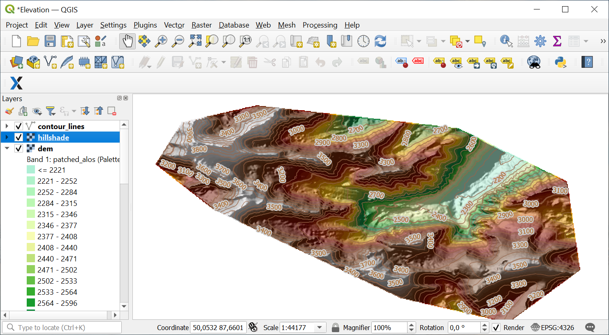

.. _data_dem_3D_to_qgis:

How to load elevation data into QGIS 3D window
===============================================
 
* `Order elevation data <https://data.nextgis.com/en/>`_ for your area of interest, e.g. in ESRI Shape (QGSIS) and GeoTIFF format choosing the step of contour lines.
* Wait for email with download link, download and unpack archive with data.
* Download and install `QGIS <https://qgis.org/en/site/forusers/download.html/>`_.
* Launch QGIS.
* Drag and drop **hillshade.tif**, **dem.tif** and **contour_lines.shp** from the unpacked data folder to QGIS interface.

   
* On the top bar click View -> 3D Map Views -> New 3D Map View

* In 3D Configuration: set the parameters for the Terrain - select a DEM (Raster Layer), specify the raster layer **dem**, select other parameters depending on your data

* Click OK. The 3D terrain data model will appear in the window

