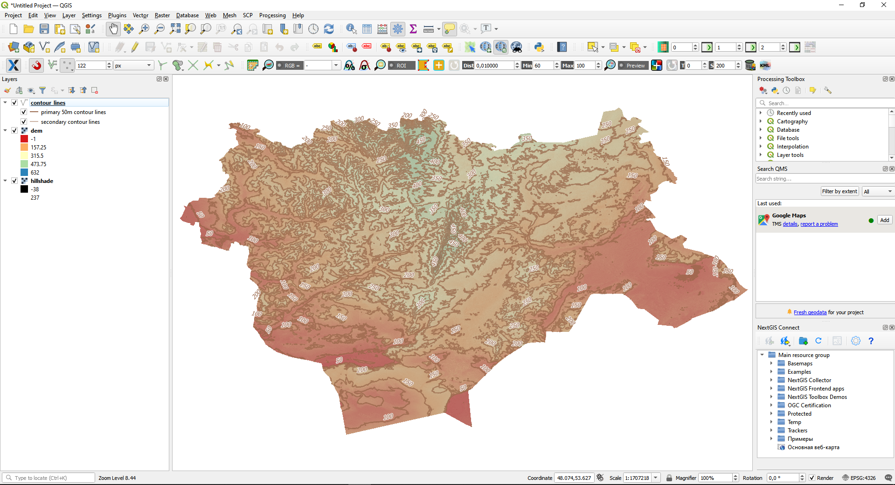

.. _data_dem_3D_to_qgis:

Как загрузить данные рельефа в 3D окно QGIS
=============================================
 
 `Закажите данные <https://data.nextgis.com/ru/>`_ рельефа на интересующую Вас территорию в формате ESRI Shape (QGIS) и GeoTIFF с указанием шага изолиний.
* Дождитесь получения результата, скачайте, распакуйте архив с данными.
* Скачайте и установите `QGIS <https://qgis.org/en/site/forusers/download.html/>`_.
* Запустите QGIS.
* Перетащите из папки с распакованными данными файлы **hillshade.tif** (светотеневая отмывка), **dem.tif** (цифровая модель рельефа) и **contour_lines.shp** (изолинии рельефа) в интерфейс QGIS, расположите слои в правильном порядке, установите прозрачность на 50%

* На верхней панели нажмите Вид -> Вид 3D карты -> Новый вид 3D карты

   
* В настройках 3D карты установите параметры для Рельефа - выберите ЦМР (растровый слой), укажите растровый слой **dem**, подберите остальные параметры в зависимости от ваших данных

   
* Нажмите OK. В окне появится модель данных рельефа в 3D.

