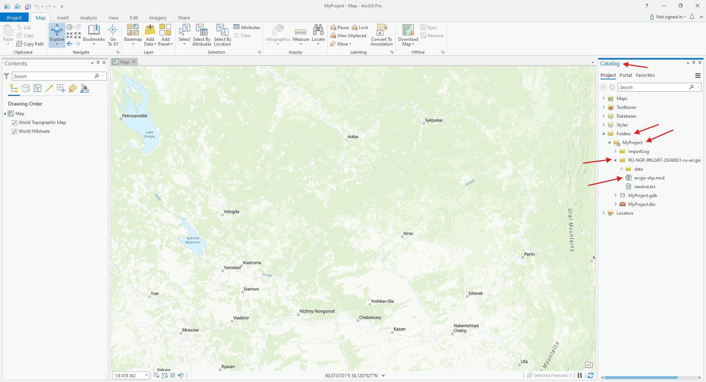
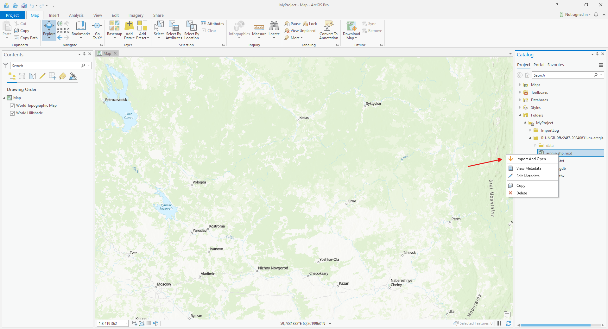
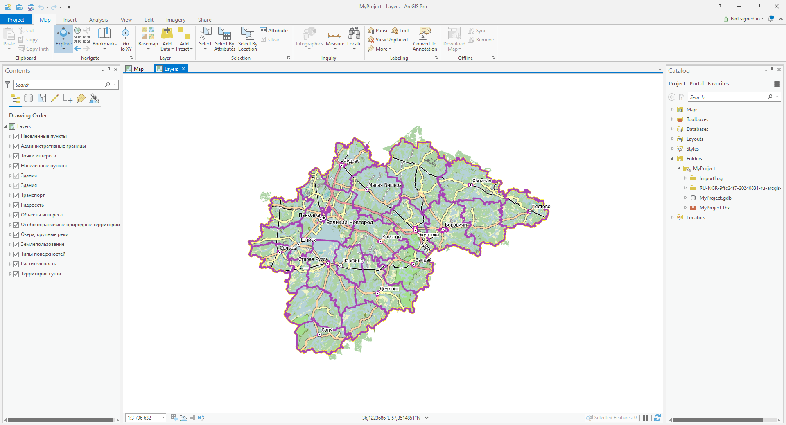

.. sectionauthor:: Aleksandr Myrov, Yuliya Grigorenko <grigorenko.j@gmail.com>

Как открыть карту или проект целиком в ArcGIS Pro
===================================================================

* `Закажите данные <https://data.nextgis.com/ru/catalog/subdivisions/?country=AU>`_ на интересующую Вас территорию в формате Shape (ArcGIS) или Geodatabase (ArcGIS).

* Скачайте и установите ArcGIS Pro, откройте его и создайте необходимую директорию для Ваших данных.

.. figure:: _static/arcgis_create_folder_ru.png
   :name: arcgis_create_folder_pic
   :align: center
   :width: 24cm

* Дождитесь получения результата, скачайте, распакуйте архив с заранее заказанными данными и поместите их в подготовленную директорию.

Готовый проект включает все слои с настроенными стилями. 

* В панели «Catalog» нажмите «Project» → «Folders» → «MyProject», далее откройте папку со скачанными данными, внутри которой находится файл формата .MXD.

* Нажмите правой кнопкой мыши на файл формата .MXD и выберите «Import And Open».

Спустя некоторое время проект будет импортирован в ArcGIS Pro и данные будут готовы к работе.

