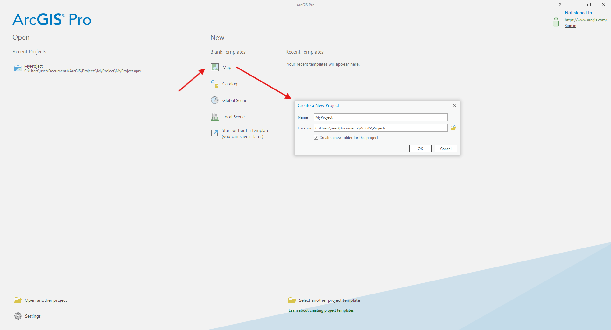
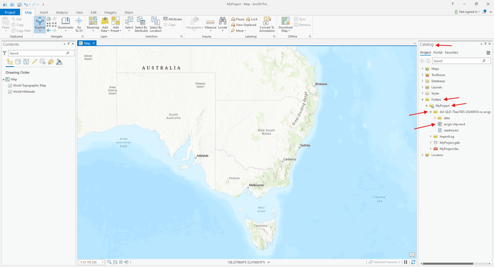
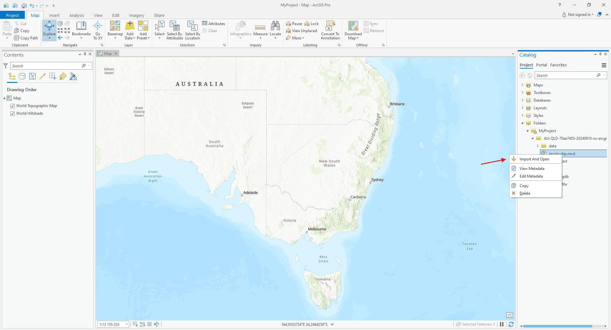
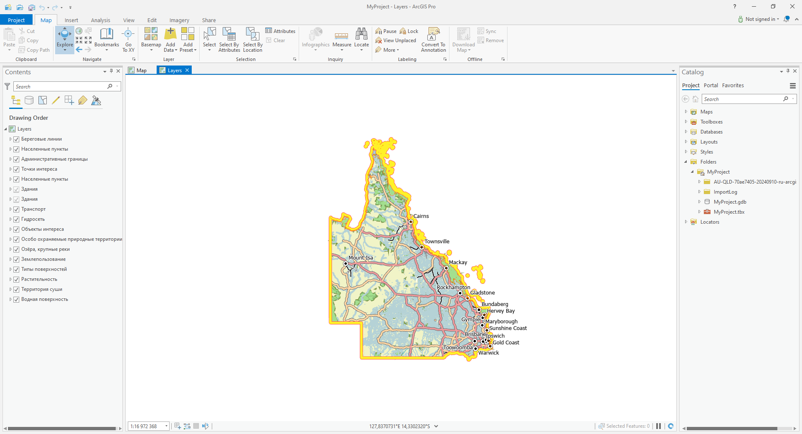

How to open a map or a project in ArcGIS Pro
===================================================================

* `Order data <https://data.nextgis.com/en/catalog/subdivisions/?country=AU>`_ for your area of interest in Shape (ArcGIS) or Geodatabase (ArcGIS) format.

* Download and install ArcGIS Pro, open it and create a folder for your data.

* Go to the `orders <https://data.nextgis.com/en/orders/actual/>`_ page and download the archive when it's complete.
* **Unpack** the archive.

Project includes all layers with preset styles. 

* In the "Catalog" panel click "Project" → «Folders» → «MyProject». Open the folder containing the data and find MXD file.

* Right-click the MXD file and select «Import And Open».

Shortly the project will be imported to ArcGIS Pro and ready for work.

