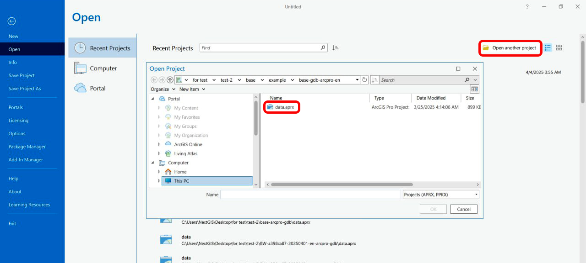
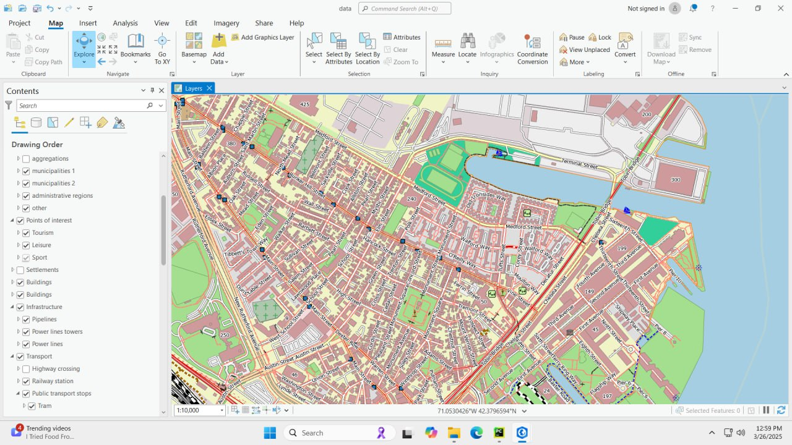
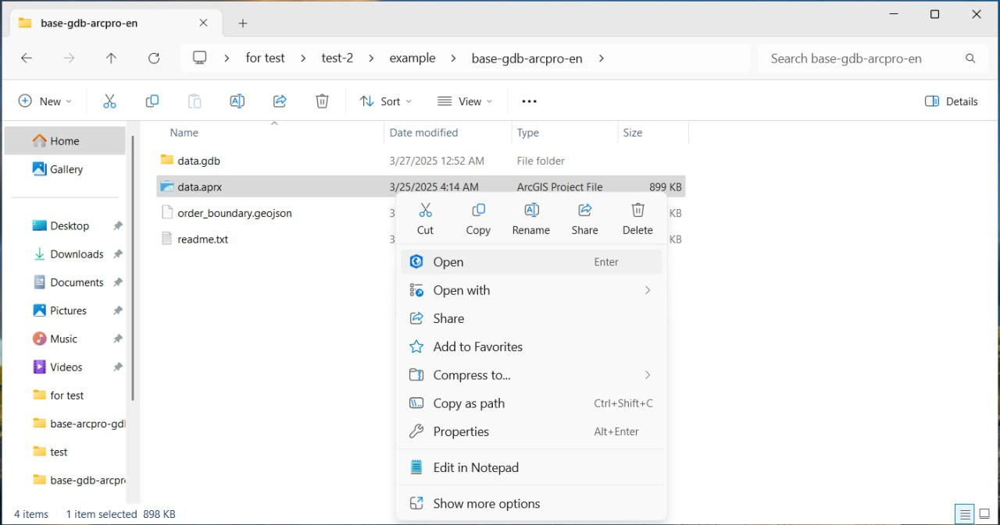

How to open your basemap project in ArcGIS Pro
=============================================

*  `Order data <https://data.nextgis.com/en/>`_ for your area of interest in ESRI Geodatabase (ArcGIS Pro) format.
* Wait for an email with the download link. Download the archive.
* **Unpack** the data.
* Launch ArcGIS Pro. On the start page, click **Open another project** and select an APRX file.

   
   Opening the project

* Your project is opened in the program.

   
   Basemap project in the ArcGIS Pro main window

Another way to open a project is to double-click the \*.aprx file or select **Open** in the context menu.

   Opening project via context menu
