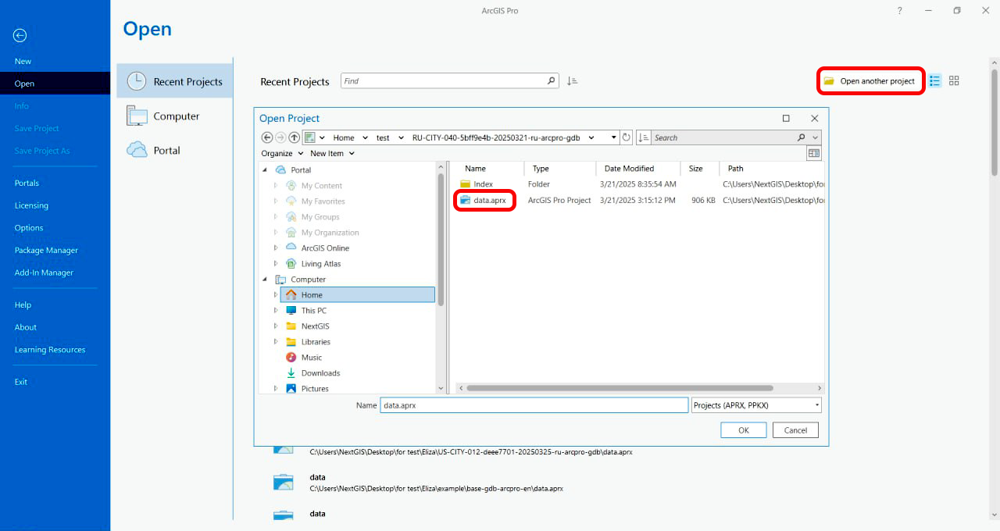

Как открыть проект базовой карты в ArcGIS Pro
=============================================

* `Закажите данные <https://data.nextgis.com/ru/>`_ на интересующую Вас территорию в формате ESRI Geodatabase (ArcGIS Pro).
* Дождитесь получения результата, скачайте.
* Распакуйте архив с данными.
* Запустите ArcGIS Pro, нажмите «Другой набор» в стартовом окне или выберите в основном окне программы ``Главная ‣ Открыть ‣ Открыть рабочий набор`` и выберите файл в формате .wor.

   
   Открытие проекта

* Проект открыт в программе.

.. figure:: _static/opened_arcgispro_ru.png
   :name: 
   :align: center
   :width: 20cm
   
   Проект базовой карты в рабочем окне программы ArcGIS Pro
