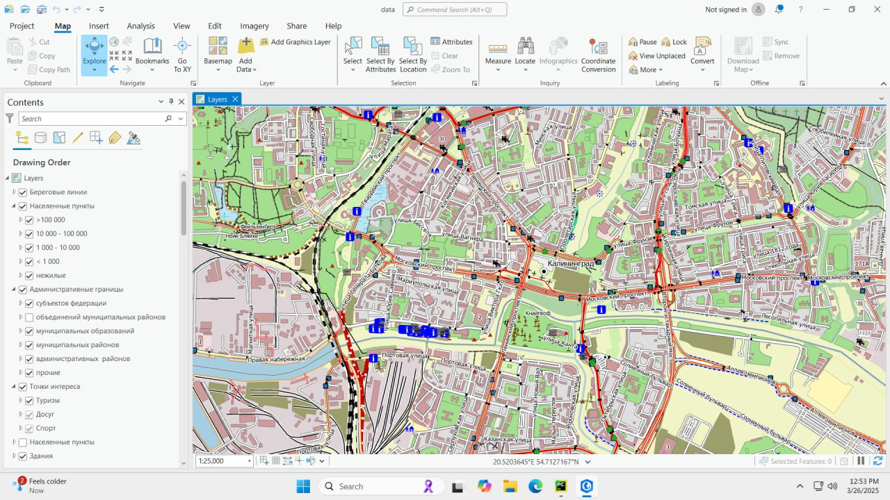
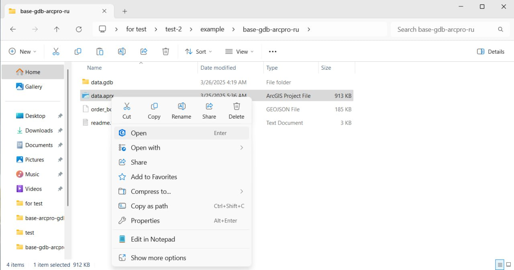

Как открыть проект базовой карты в ArcGIS Pro
=============================================

* `Закажите данные <https://data.nextgis.com/ru/>`_ на интересующую Вас территорию в формате ESRI Geodatabase (ArcGIS Pro).
* Дождитесь получения результата, скачайте.
* Распакуйте архив с данными.
* Запустите ArcGIS Pro, на начальной странице щелкните **Открыть другой проект** и выберите файл в формате APRX.

.. figure:: _static/open_arcgispro_menu_ru.png
   :name: open_arcgispro_menu_pic
   :align: center
   :width: 22cm
   
   Открытие проекта

* Проект открыт в программе.

   
   Проект базовой карты в рабочем окне программы ArcGIS Pro

Также можно открыть проект, просто кликнув дважды на файле \*.aprx или выбрав в контекстном меню **Открыть**.

   Открытие проекта через контекстное меню
