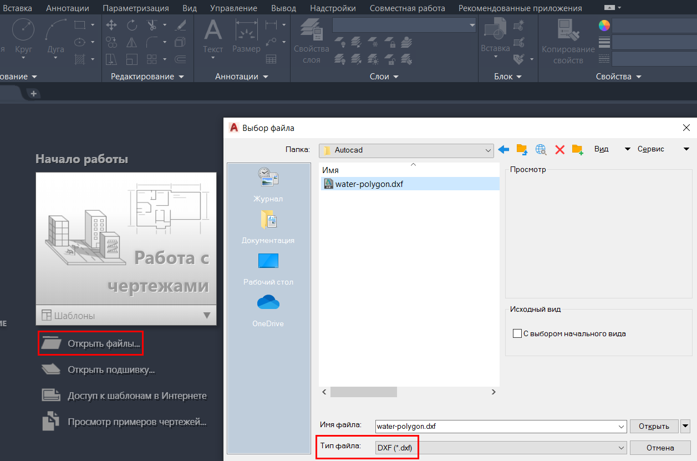
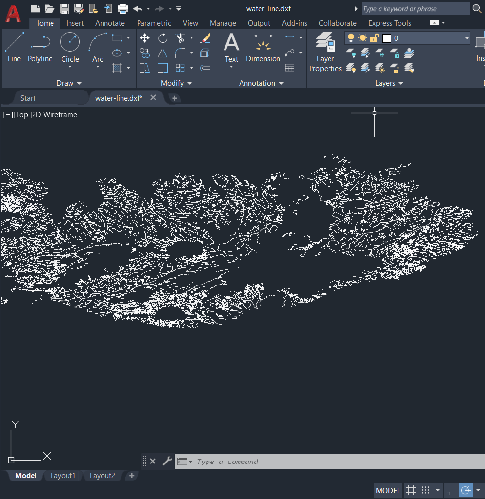

.. _data_autocad:

Как добавить слой в AutoCAD
===========================

* `Закажите данные <https://data.nextgis.com/ru/>`_ на интересующую Вас территорию, например, в формате GeoJSON.
* Дождитесь получения результата, скачайте, распакуйте архив с данными.
* Конвертируйте желаемый слой или слои в формат DXF. Для конвертации можно воспользоваться любым онлайн конвертером, например, |location_link|.

.. |location_link| raw:: html

   <a href=https://geoconverter.infs.ch/" target="_blank">GeoConverter</a>     
   
* Запустите AutoCAD, нажмите «Открыть файлы» и выберите слой в формате DXF.

* Слой добавлен в рабочее пространство AutoCAD

