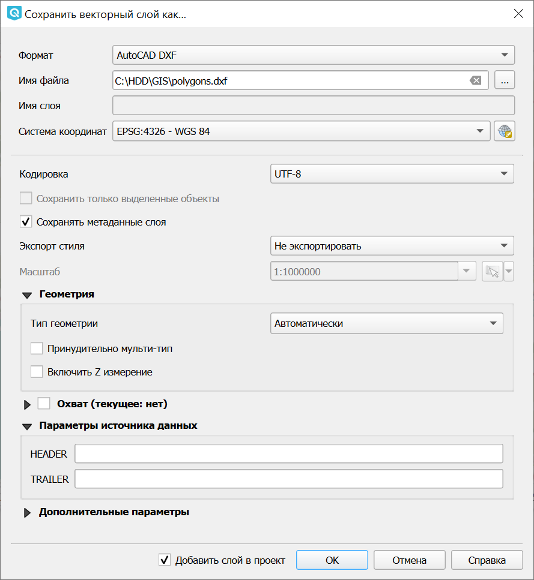
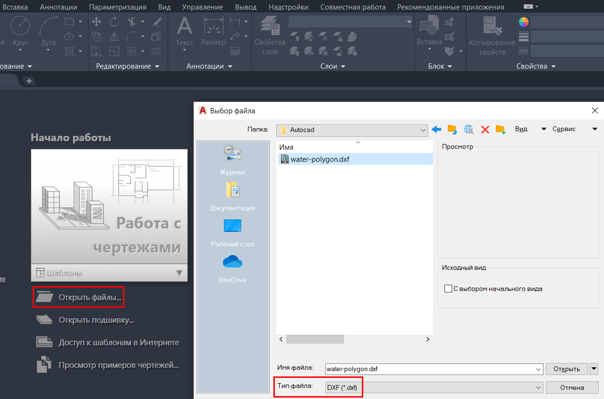
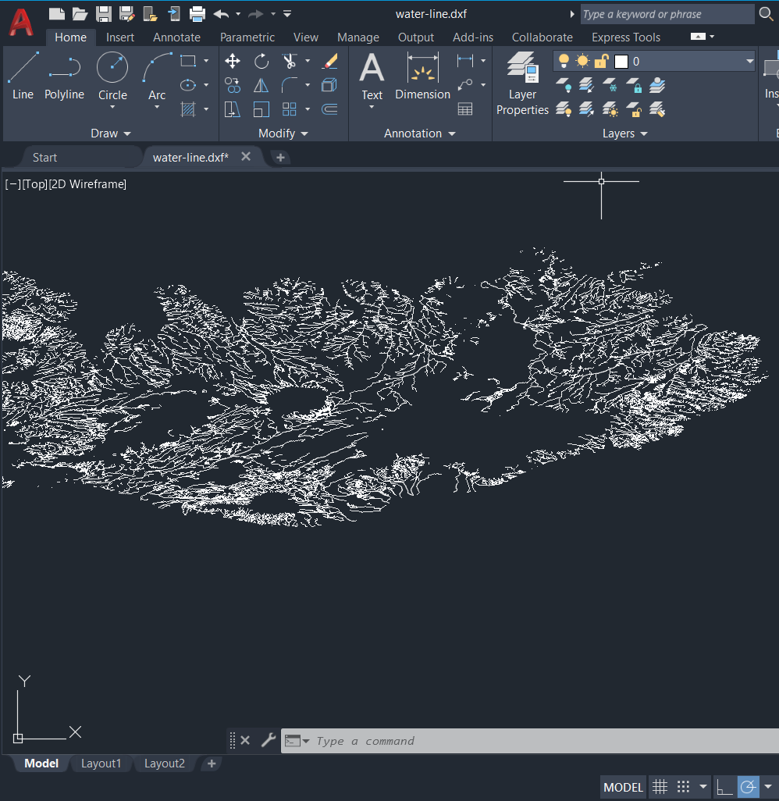

.. _data_autocad:

Как добавить слой в AutoCAD
===========================

* `Закажите данные <https://data.nextgis.com/ru/>`_ на интересующую Вас территорию, например, в формате GeoPackage.
* Дождитесь получения результата, `скачайте <https://data.nextgis.com/ru/orders/actual/>`_ и **распакуйте** архив с данными.
* Конвертируйте желаемый слой или слои в формат DXF. Это можно сделать с помощью NextGIS QGIS. Откройте слой в QGIS, затем в верхнем меню выберите: Слой --> Сохранить как. В открывшемся диалоге установите формат AutoCAD DXF.

   
* Запустите AutoCAD, нажмите «Открыть файлы» и выберите слой в формате DXF.

* Слой добавлен в рабочее пространство AutoCAD

