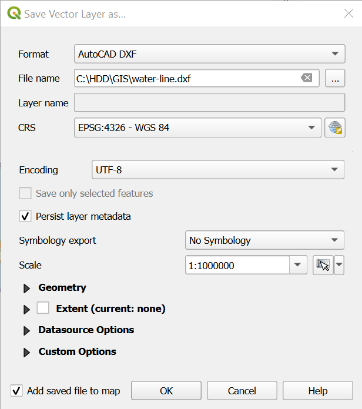

.. _data_autocad:

How to import data into AutoCAD
================================

#. `Order data <https://data.nextgis.com/en/>`_ for your area of interest, e.g. in GeoJSON format.
#. Go to the `orders <https://data.nextgis.com/en/orders/actual/>`_ page and download the archive when it's complete.
#. **Unpack** the archive.
#. Convert target layer or layers into :term:`DXF` format. You can use QGIS to save th file as DXF. From the top menu open Layer --> Save as, then select AutoCAD DXF.

#. Launch AutoCAD, press “Open files” and choose layer in DXF format.

   .. figure:: _static/autocad1.png
      :name: autocad1
      :align: center
      :width: 20cm

#. Layer is imported into AutoCAD working environment.

   .. figure:: _static/autocad2.png
      :name: autocad2
      :align: center
      :width: 20cm
