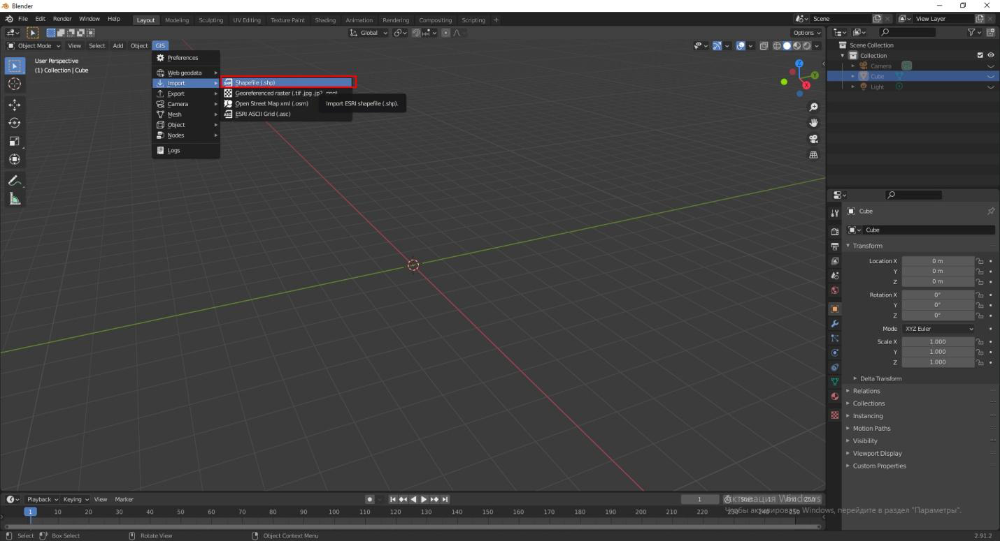
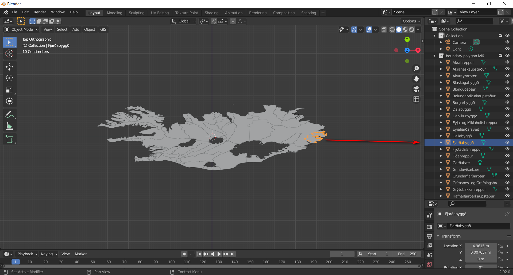

.. _data_blender:

Как загрузить данные в Blender
=============================

.. note::
   Предполагается, что  в приложении Blender уже загружено и настроено дополнение Blender GIS для работы с пространственными данными.

* `Закажите данные <https://data.nextgis.com/ru/>`_ на интересующую Вас территорию, например, в формате ESRI Shape (QGIS).
* Дождитесь получения результата, скачайте, распакуйте архив с данными.
* В программе Blender запустите установленное дополнение Blender GIS, нажав на иконку **GIS** наверху слева. В выпадающем меню выберете опцию **Import** и выберете формат **Shapefile**.
* При загрузке файла с пространственными данными настройте параметры визуализации в всплывающем окне. 
  Чтобы отобразить отдельные объекты, а не контур слоя в целом, поставьте галочку **Separate objects** и 
  выберете желаемое атрибутивное поле **Object name from field** для идентификации каждого объекта в слое. Нажмите **ОК**

* Ваша карта загружена. Отмеченное поле с атрибутивной информацией находится справа.

