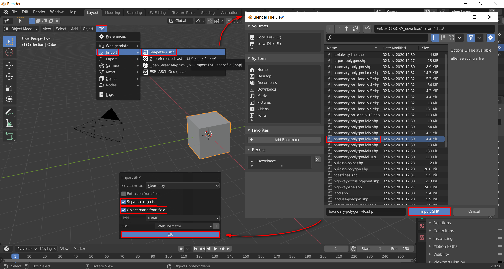

.. _data_blender:

How to upload data to Blender
=============================

.. note::
   It is assumed that the Blender GIS add-on is already installed and ready for working with spatial data.

* `Order data <https://data.nextgis.com/en/>`_ for your area of interest in ESRI Shape (QGIS) format.
* Wait for email with download link, download and unpack archive with data.
* In Blender at the top left select "GIS" > "Import" > "Shapefile (.shp)".
* In the pop-up window find the target layer and press "Import SHP" button.
* Another pop-up window emerges in the bottom right. Here you can adjust visualization parameters. To display individual objects, and not the outline of the layer as a whole, check the "Separate objects" checkbox. Check the "Object name from field" checkbox and specify the field to identify each object in the layer with. Click "OK".

* Your map is uploaded. Atributive information of selected object is shown in the right panel.

.. figure:: _static/blender2.png
   :name: blender2
   :align: center
   :width: 16cm
