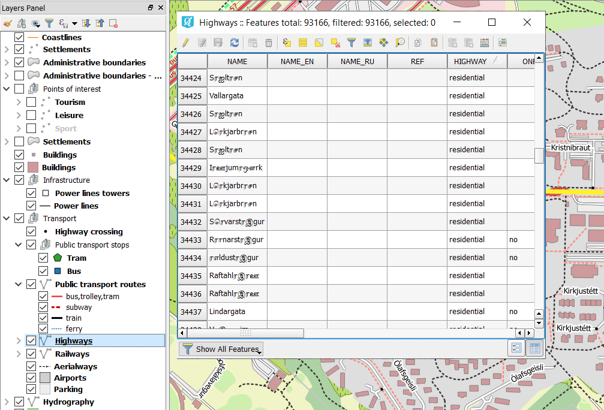
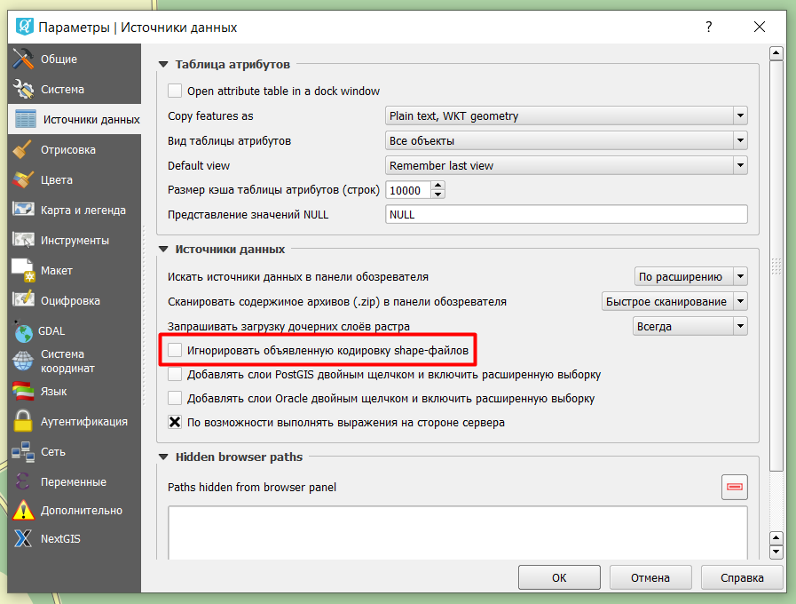
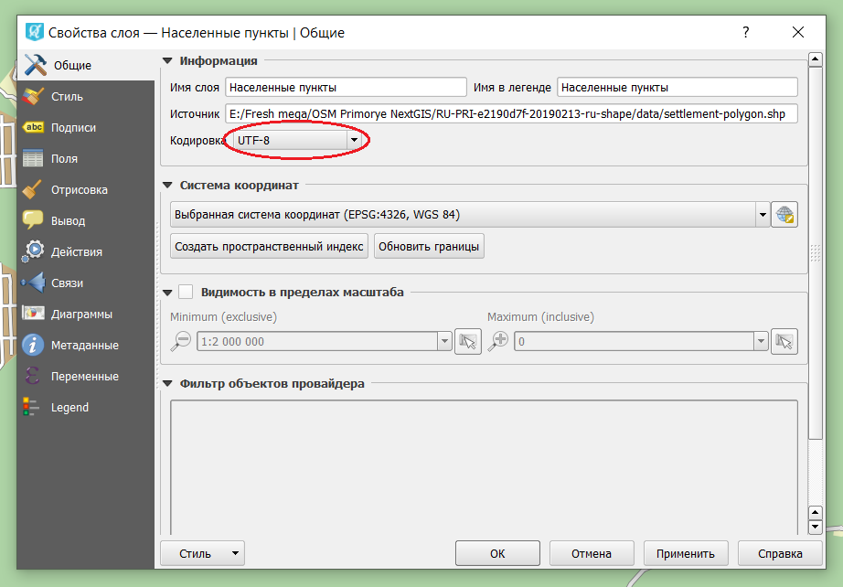

.. _data_broken_encoding:

Что делать, если атрибутивная информация слоя отображается некорректно
===========================

* Рекомендуем убедиться, что используемая ГИС не игнорирует информацию о кодировке векторных слоев. Для `NextGIS QGIS <https://nextgis.ru/nextgis-qgis/>`_ данная опция настраивается через “Установки” > “Параметры” > “Источники данных”. Если напротив пункта “Игнорировать объявленную кодировку shape-файлов” стоит галочка, снимите ее.

* Также стоит проверить кодировку слоя, чьи атрибуты отображаются некорректно, на соответствие исходной кодировке. Варианты исходной кодировки перечислены на `этой странице <https://data.nextgis.com/ru/about/#formats>`_ и зависят от формата, в котором Вы заказали данные. Кодировка слоя отображается в его свойствах.

