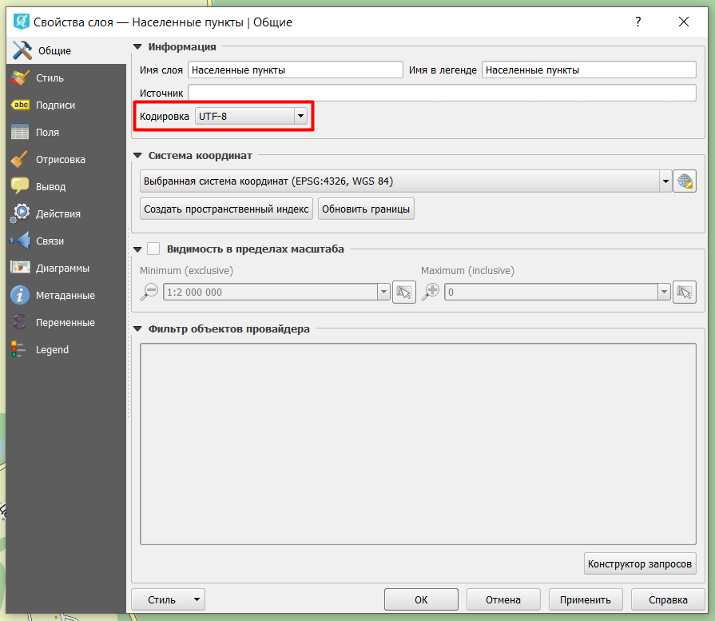

.. _data_broken_encoding:

What if text in attribute table is garbled…
===========================

* It is recommended to ensure that your GIS doesn’t ignore layer encoding information. For `NextGIS QGIS <https://nextgis.com/nextgis-qgis/>`_ it can be checked via “Settings” > “Options” > “Data Sources”. If the box with “Ignore shapefile encoding declaration” is checked, uncheck it.

* It can be also helpful to check, does encoding of “problematic” layer correspond to initial encoding. Possible initial encodings are listed `here <https://data.nextgis.com/en/about/#formats>`_ and depend on format of your ordered data. Encoding of the layer is shown in its “Properties” menu.

