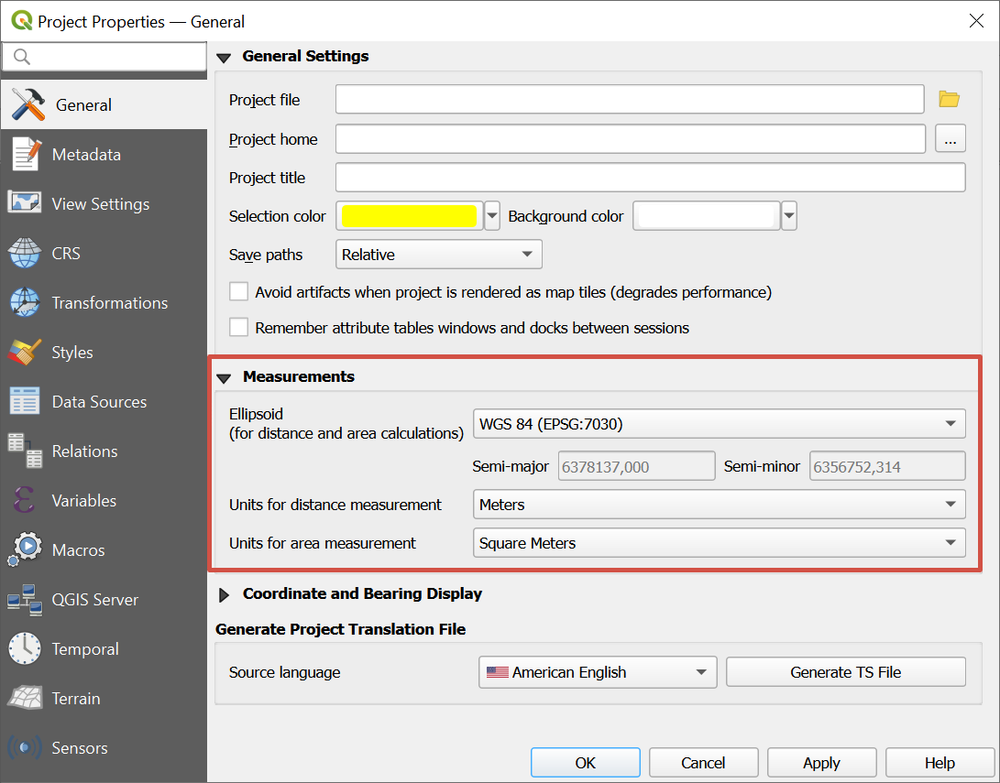
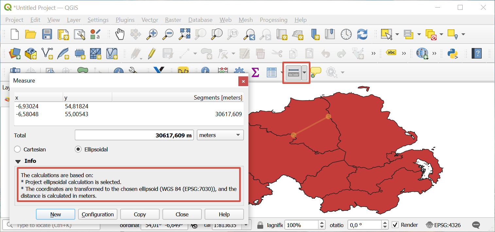
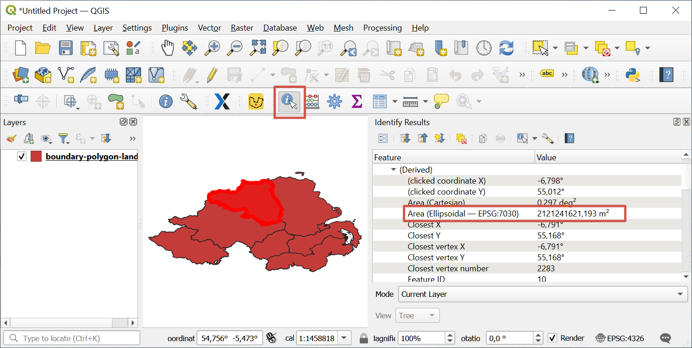
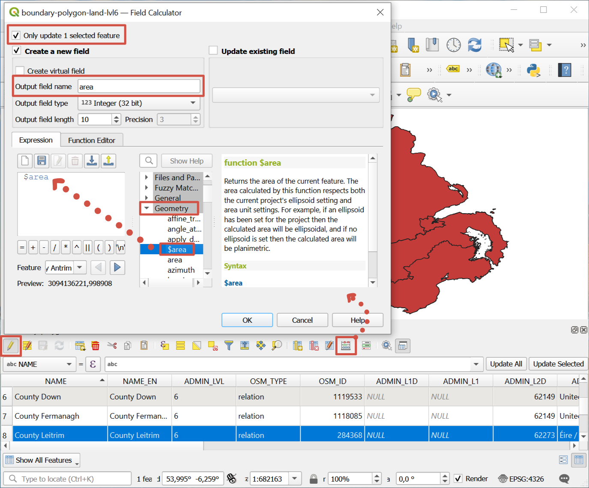
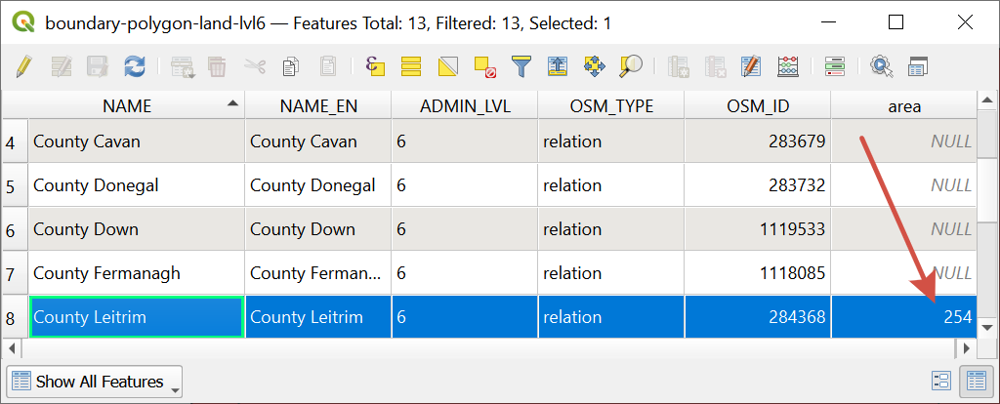

.. _data_calc_area:

When area or distance differs from the real value
=====================================

To receive the most accurate values for distances or areas it is recommended to perform ellipsoid-based calculation (it helps to avoid distortion which appears while using any projected data).
QGIS settings offer an easy way to perform correct calculations regardless of data initial coordinate system.

* In Menu Toolbar select “Project” > “Project Properties…”.

* In the pop-up window switch to the “General” tab and in the “Measurements” section set an ellipsoid for calculations, e.g. WGS 84, and target units for distance and area measurements. Click on “Apply” button and close the window.

   
Now distances and areas will be calculated correctly via any of the possible methods:

* With the tool “Measure Line”/“Measure area” from the Attribute Toolbar:

   
* With the tool “Identify Features” from the same Attribute Toolbar:

   
* With the Field Calculator in the Attribute Table of the layer:

   

