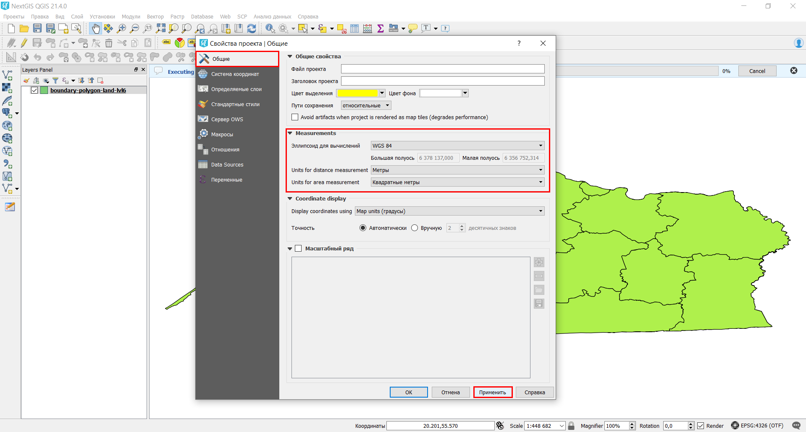
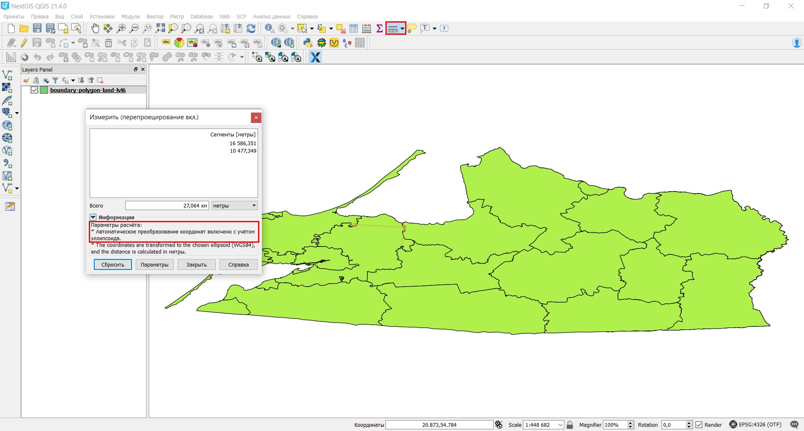
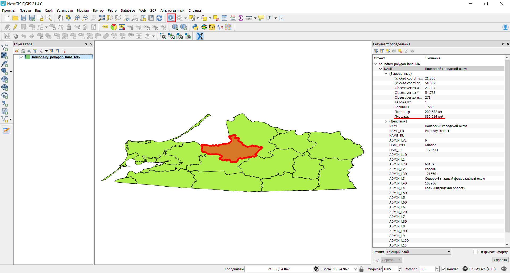
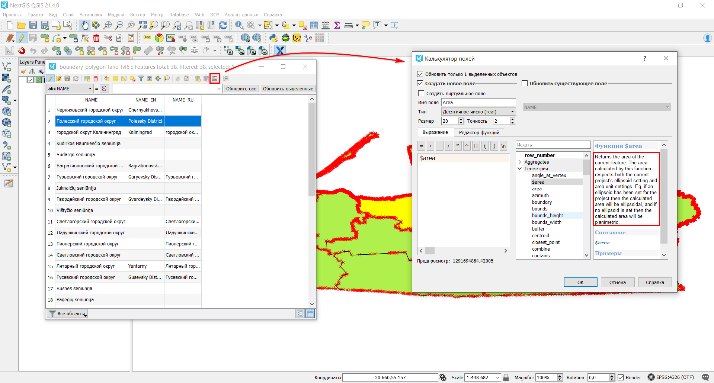
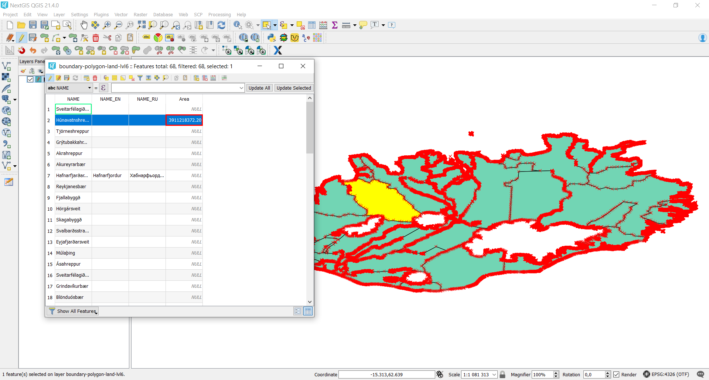

.. _data_calc_area:

Если длины или площади не соответствуют ожидаемым значениям
===========================================================

Для того чтобы получать длину и площадь, приближенные к значениям на местности, необходимо вычислять их непосредственно на эллипсоиде. Это поможет избежать искажений, которые, в большей или меньшей степени, привносит использование любой проекции.
Функционал `NextGIS QGIS <https://nextgis.ru/nextgis-qgis/>`_ или обычной QGIS позволяет быстро установить нужные параметры для вычисления, вне зависимости от исходной системы координат данных.

* В панели меню выберите «Проекты» > «Свойства проекта…» и в открывшемся окне перейдите во вкладку «Общие». В разделе «Measurements» выберите эллипсоид для вычислений, например, WGS 84, а также желаемые единицы для измерения площадей и длин. Нажмите «Применить» и закройте окно настройки.

   
Теперь длины и площади будут рассчитываться корректно любым из трех возможных способов:

* В главной панели меню – инструментом «Измерить площадь»/«Измерить линию»:

   
* Также в главной панели меню – инструментом «Определить объекты»:

   
* С помощью калькулятора полей в таблице атрибутов слоя:

   

