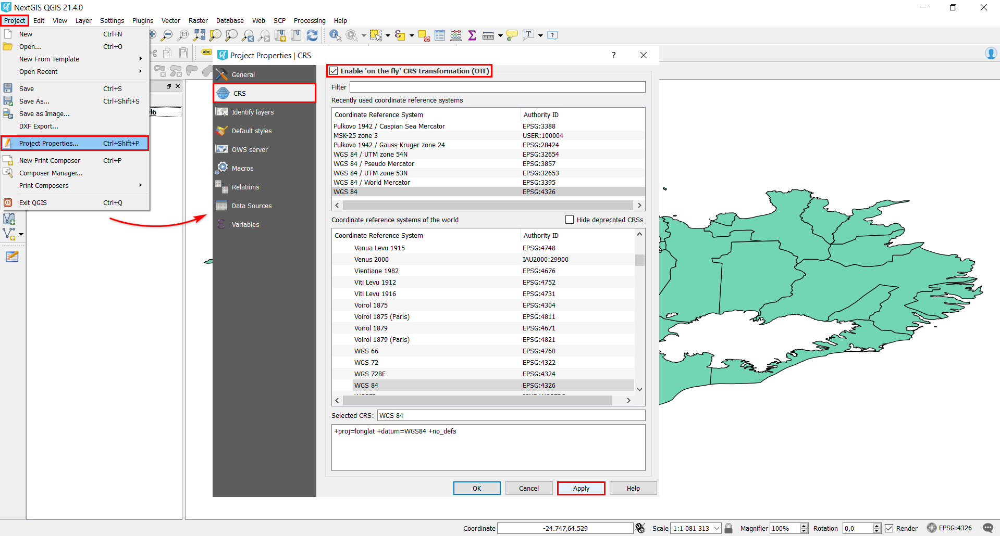
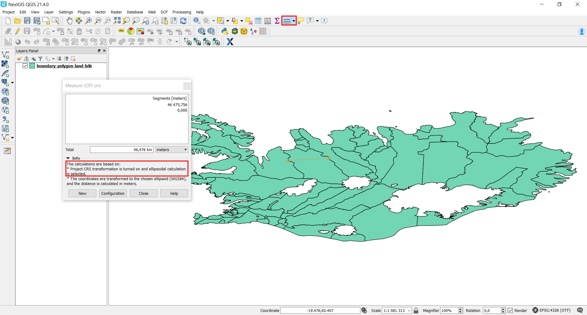

.. _data_calc_area:

Длины или площади не соответствуют реальным значениям, помогите!
===========================

Для того чтобы получить наиболее точные значения длин и площадей, необходимо произвести вычисления непосредственно на эллипсоиде (это поможет избежать искажений, которые, в большей или меньшей степени, привносит использование любой проекции).
Функционал `NextGIS QGIS <https://nextgis.ru/nextgis-qgis/>`_ позволяет быстро установить нужные параметры для корректного вычисления, вне зависимости от исходной системы координат данных.

* В панели меню выберите «Проекты» > «Свойства проекта…» и в открывшемся окне перейдите во вкладку «Система координат». 
* Поставьте галочку напротив «Enable ‘on the fly’ CRS transformation (OTF)», нажмите «Применить».

* В том же окне перейдите во вкладку «Общие», в разделе «Measurements» выберите эллипсоид для вычислений, например, WGS 84, а также желаемые единицы для измерения площадей и длин. Нажмите «Применить» и закройте окно настройки.

.. figure:: _static/calc_area2.png
   :name: calc_area2
   :align: center
   :width: 16cm
   
Теперь длины и площади будут рассчитываться корректно любым из трех возможных способов:

* В главной панели меню – инструментом «Измерить площадь»/«Измерить линию»:

   
* Также в главной панели меню – инструментом «Определить объекты»:

.. figure:: _static/calc_area4.png
   :name: calc_area4
   :align: center
   :width: 16cm
   
* С помощью калькулятора полей в таблице атрибутов слоя:

.. figure:: _static/calc_area5.png
   :name: calc_area5
   :align: center
   :width: 16cm
   

