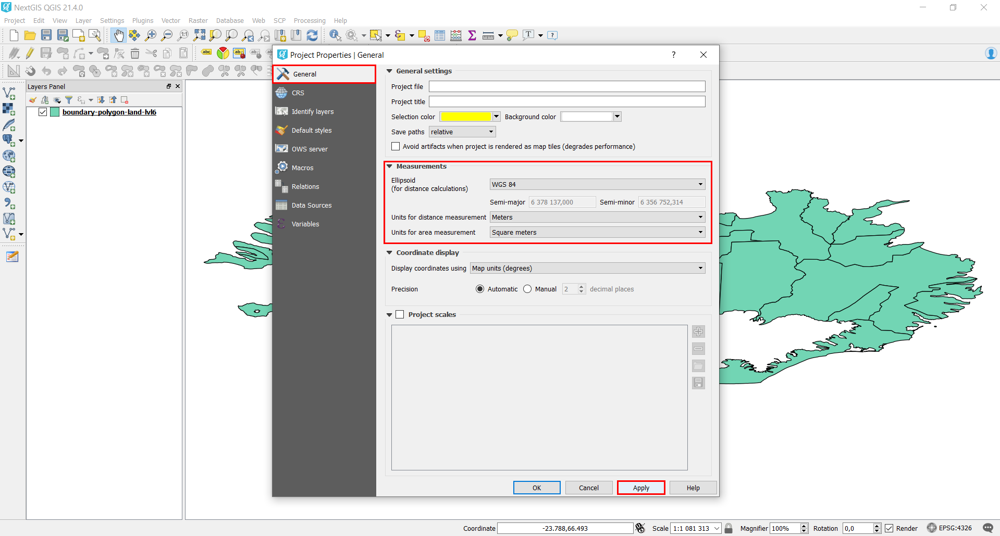

.. _data_calc_area:

When area or distance differs from the real value
=====================================

To receive the most accurate values for distances or areas it is recommended to perform ellipsoid-based calculation (it helps to avoid distortion which appears while using any projected data).
QGIS settings offer an easy way to perform correct calculations regardless of data initial coordinate system.

* In Menu Toolbar select “Project” > “Project Properties…” and in pop-up window move to the “CRS” tab.
* Check the box next to “‘Enable ‘on the fly’ CRS transformation (OTF)”, click on “Apply” button.

.. figure:: _static/calc_area1.png
   :name: calc_area1
   :align: center
   :width: 16cm

* In the same window switch to the “General” tab and in the “Measurements” section set an ellipsoid for calculations, e.g. WGS 84, and a target units for distance and area measurements. Click on “Apply” button and close the window.

   
Now distances and areas will be calculated correctly via any of the possible methods:

* With the tool “Measure Line”/“Measure area” from the Attribute Toolbar:

.. figure:: _static/calc_area3.png
   :name: calc_area3
   :align: center
   :width: 16cm
   
* With the tool “Identify Features” from the same Attribute Toolbar:

.. figure:: _static/calc_area4.png
   :name: calc_area4
   :align: center
   :width: 16cm
   
* With the Field Calculator in the Attribute Table of the layer:

.. figure:: _static/calc_area5.png
   :name: calc_area5
   :align: center
   :width: 16cm
   
.. figure:: _static/calc_area6.png
   :name: calc_area6
   :align: center
   :width: 16cm
