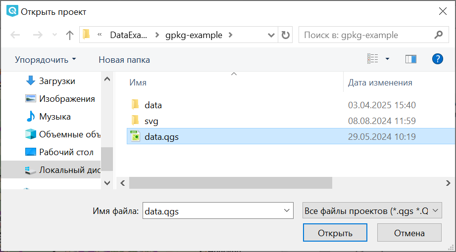
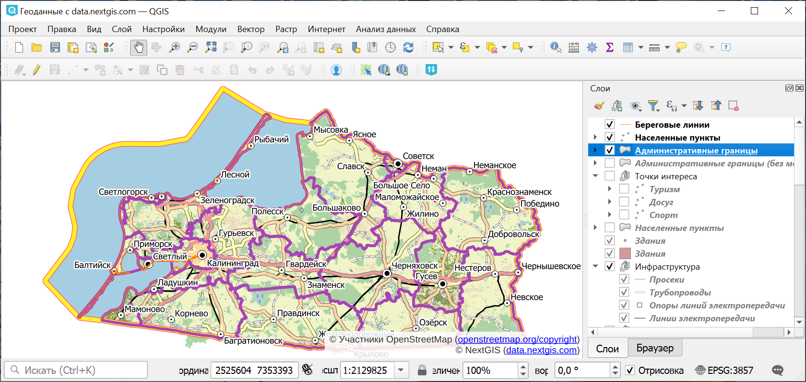
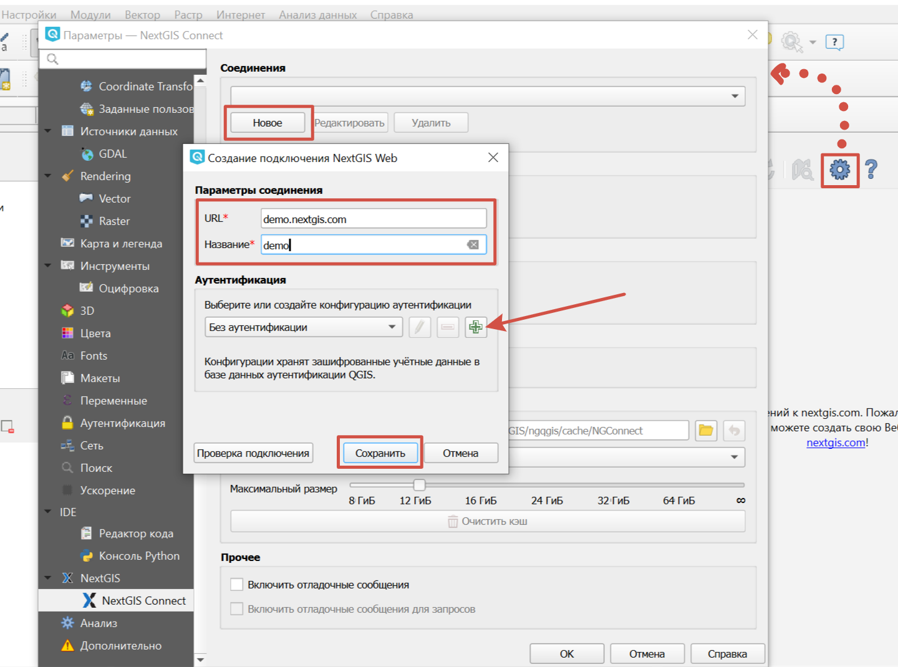
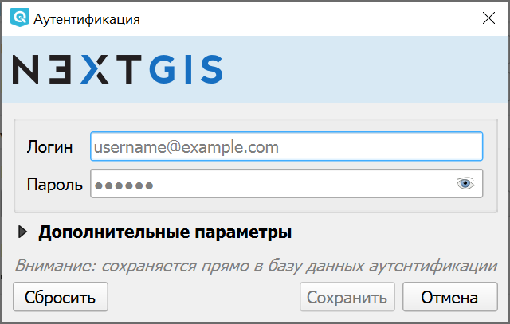
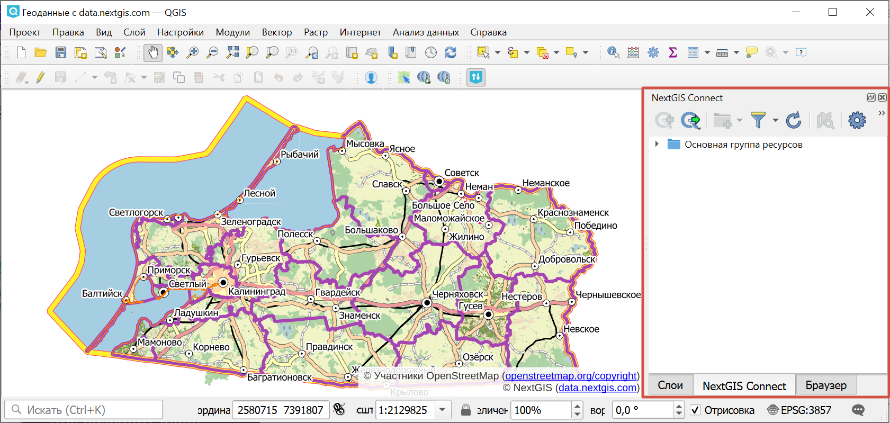
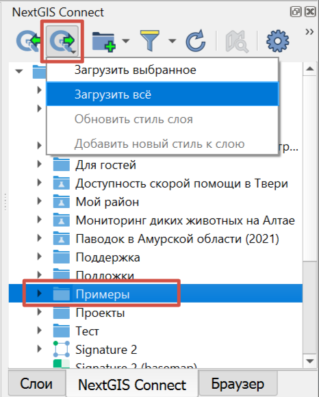
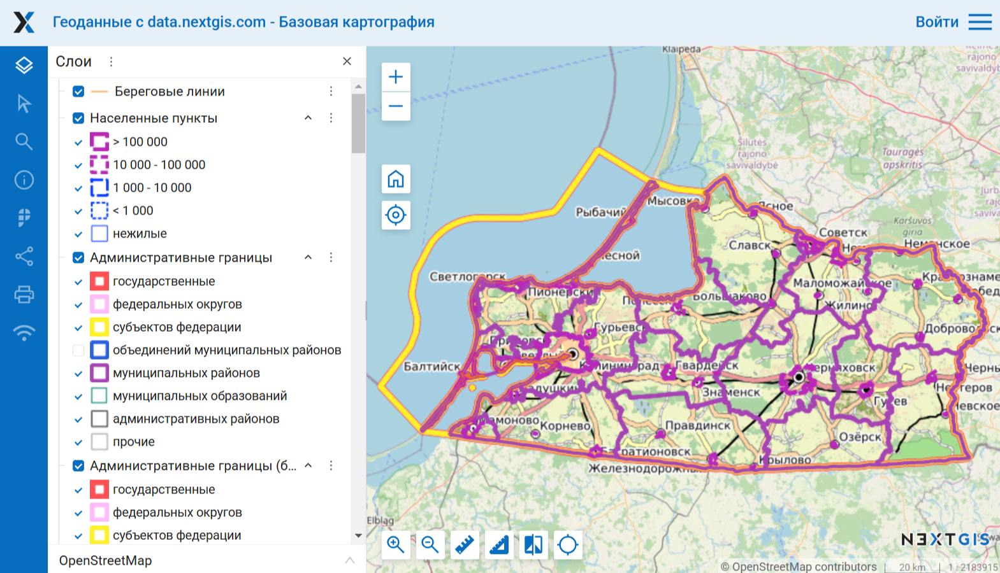

.. _data_connect_to_ngw:

Как загрузить данные в NextGIS Web (NextGIS Connect)
====================================================

* `Закажите данные <https://data.nextgis.com/ru/>`_ на интересующую территорию в формате GeoPackage (QGIS).
* Дождитесь получения результата, скачайте.
* **Распакуйте** архив с данными.
* Скачайте и установите `NextGIS QGIS <https://nextgis.ru/nextgis-qgis/>`_ или обычный QGIS.
* Запустите QGIS. Чтобы открыть полученные данные, нажмите на Меню - Проекты - Открыть проект. Перейдите в папку с заказом - Откройте файл data.qgs.

В результате проект будет полностью загружен в QGIS.

   
* Установите модуль **NextGIS Connect** (Меню - Модули -Управление модулями - Ввести в поиске *NextGIS Connect* - Установить). В NextGIS QGIS модуль уже установлен, нужно его только обновить до последней версии.

* Появится панель модуля NextGIS Connect. Также панель можно открыть при помощи кнопки |connect_icon| на панели инструментов. 

.. |connect_icon| image:: _static/logo_connect.png
   :width: 6mm

.. figure:: _static/connect_panel_ru_2.png
   :name: connect_panel
   :align: center
   :width: 8cm

* **Настройте** подключение к вашей веб ГИС:

1. Нажмите на кнопку настроек (шестеренка на панели).

2. В открывшейся панели Соединений создайте новое подключение (укажите URL вашей веб ГИС и при необходимости логин/пароль пользователя веб ГИС). 

3. Нажмите *Сохранить*, затем закройте окно настроек. В панели модуля появятся все ресурсы вашей веб ГИС.

 

4. Выберите *группу ресурсов*, в которую вы хотите поместить ваш проект, нажмите на кнопку |button_to_wg| **Добавить в веб ГИС** в панели модуля и *импортируйте* текущий проект.

.. |button_to_wg| image:: _static/button_to_wg.png
   :width: 6mm

В течение некоторого времени откроется веб-карта с настроенным проектом.

