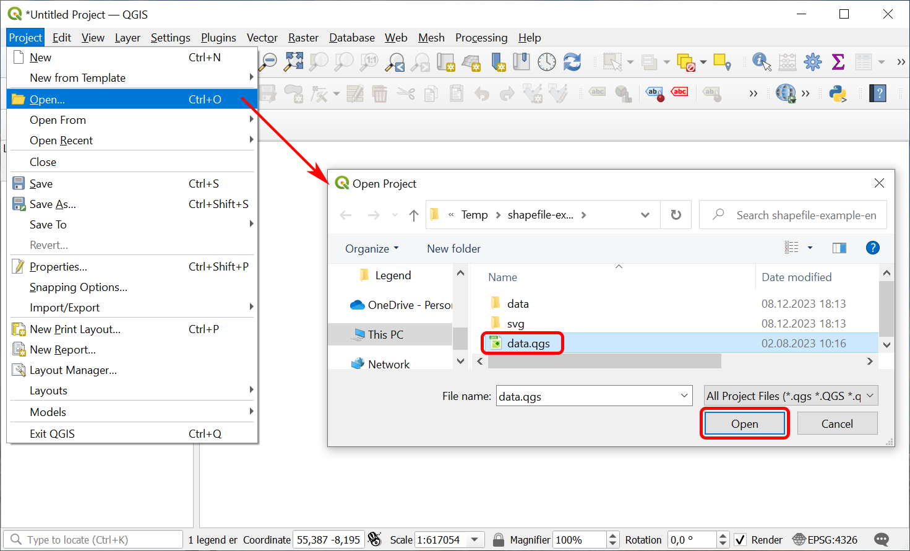
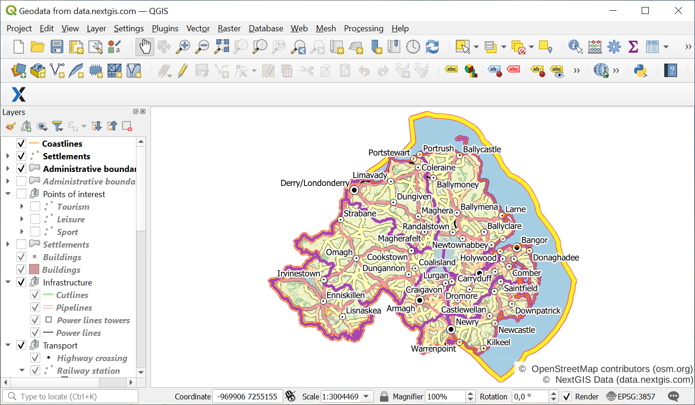
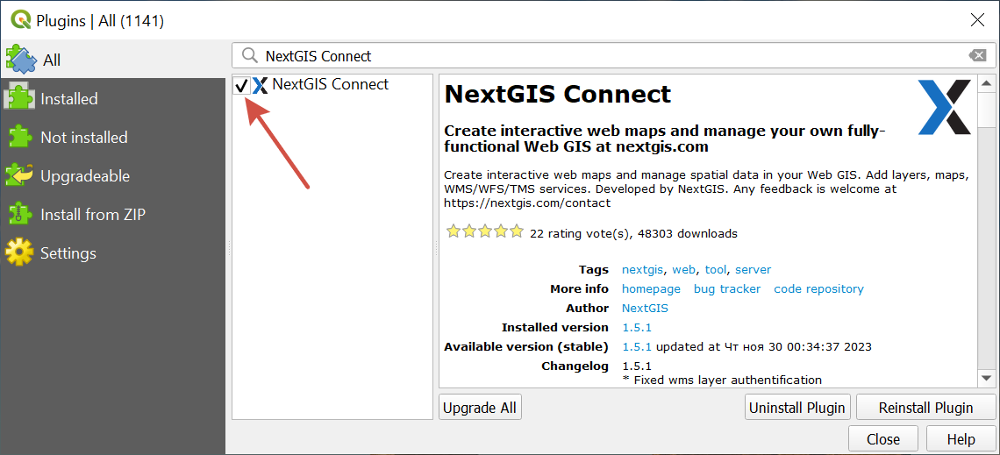
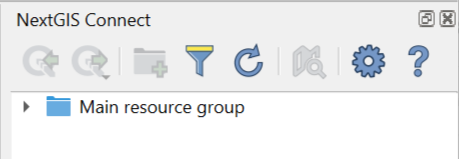
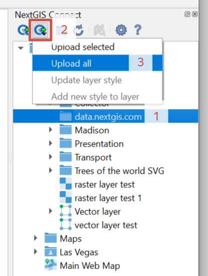
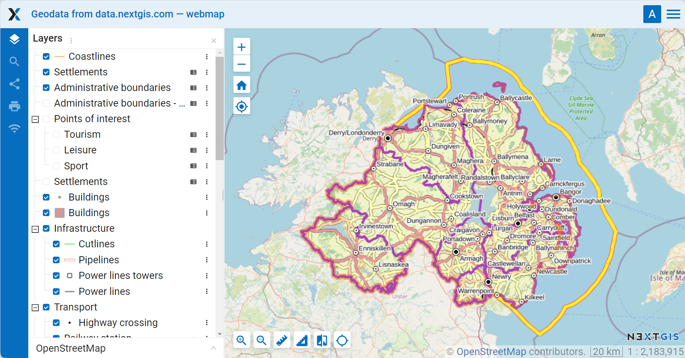

.. _data_connect2ngw:

How to upload data to NextGIS Web with NextGIS Connect
==========================================================

* `Order data <https://data.nextgis.com/en/>`_ for your area of interest in Geopackage format (QGIS).
* Go to the `orders <https://data.nextgis.com/en/orders/actual/>`_ page and download the archive when it's complete.
* **Unpack** the archive.
* Download and install `QGIS <https://qgis.org/en/site/forusers/download.html>`_.
* Launch QGIS. To open a preset GIS project (which includes all layers with customized styles), click "Project" > "Open" and in pop-up window select the saved file "data.qgs".

* The project will be added to QGIS.

   
* To transfer GIS project from QGIS to NextGIS Web special plugin is needed. In Menu Toolbar select "Plugins" > "Manage and Install Plugins". In pop-up window type "NextGIS Connect" into Search field. Check the box next to the plugin to activate it.

* NextGIS Connect panel will appear. You can also call this panel via |logo_connect| button from the toolbar.

.. figure:: _static/panel-no-connections_en.png
   :name: panel-no-connections_pic
   :align: center
   :width: 9cm
      
* Set connection to your Web GIS: press "Settings" button |button_settings|, then in pop-up window press "New", in next pop-up window fill in all the fields with the details of your Web GIS and press "Save". If needed, add authentication configuration with your NextGIS ID login and password.

Press "Close" to finish settings.

.. figure:: _static/create_connection_en.png
   :name: connect2ngw4
   :align: center
   :width: 20cm

.. figure:: _static/auth_config_create_en_2.png
   :name: connect2ngw4
   :align: center
   :width: 10cm
      
* In NextGIS Connect panel resources from your Web GIS are displayed now.

      
* Select Resource group which will host GIS project, press |button_to_wg| "Add to Web GIS" button and select "Import current project" from drop-down list.

.. |button_to_wg| image:: _static/button_to_wg.png
   :width: 6mm

      
* Web map with preset project will appear in your Web GIS

