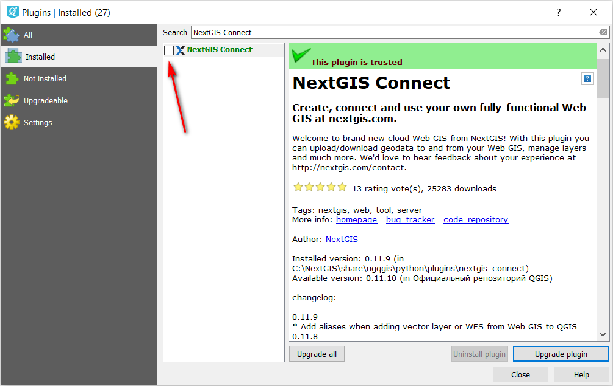
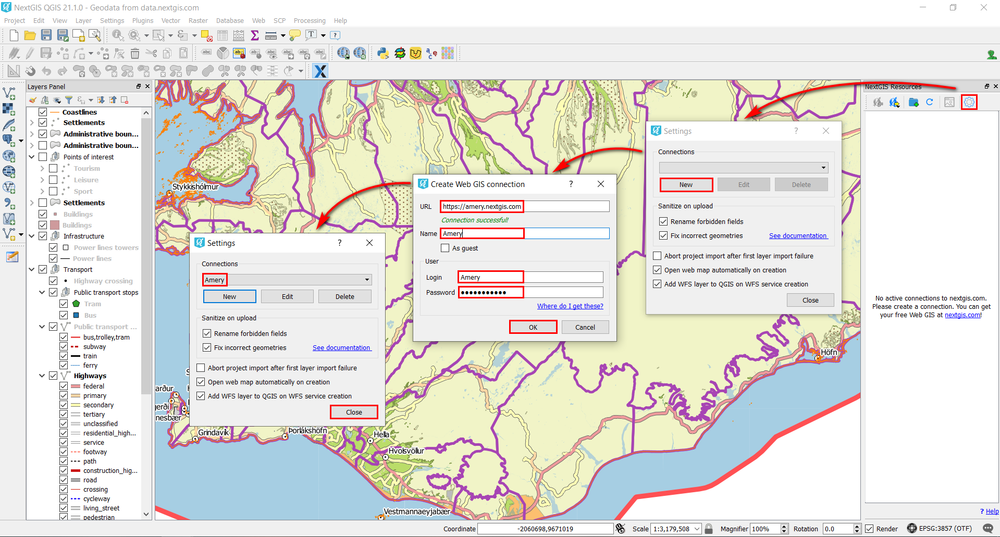
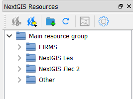

.. _data_connect2ngw:

How to upload data to NextGIS Web (via NextGIS Connect)
===========================

* `Order data <https://data.nextgis.com/en/>`_ for your area of interest in ESRI Shape format (QGIS).
* Wait for email with download link, download and unpack archive with data.
* Download and install `NextGIS QGIS <https://qgis.org>`_ or `NextGIS QGIS <https://nextgis.com/nextgis-qgis/>`_.
* Launch QGIS. To open a preset GIS project (which includes all layers with customized styles), click "Project" > "Open" and in pop-up window select the saved file "data.qgs".

.. figure:: _static/open_map1.png
   :name: open_map1
   :align: center
   :width: 16cm

* The project will be added to NextGIS QGIS.

.. figure:: _static/open_map2.png
   :name: open_map2
   :align: center
   :width: 16cm
   
* To transfer GIS project from NextGIS QGIS to NextGIS Web special plugin is needed. In Menu Toolbar select "Plugins" > "Manage and Install Plugins". In pop-up window type "NextGIS Connect" into Search field. Check the box next to the plugin to activate it.

* NextGIS Connect panel will appear. You can also call this panel via |connect2ngw2| button from the toolbar. 

      
* Set connection to your Web GIS: press "Settings" button (gear icon), then in pop-up window press "New", in next pop-up window fill in all the fields with the details of your Web GIS and press "OK". You can notice, that in very first pop-up window the name of connection appeared; press "Close" to finish settings.

      
* In NextGIS Connect panel resources from your Web GIS are displayed now.

      
* Select Resource group which will host GIS project, press "Add to Web GIS" button and select "Import current project" from drop-down list.

      
* Web map with preset project will appear in your Web GIS

.. figure:: _static/connect2ngw7.png
   :name: connect2ngw7
   :align: center
   :width: 16cm
