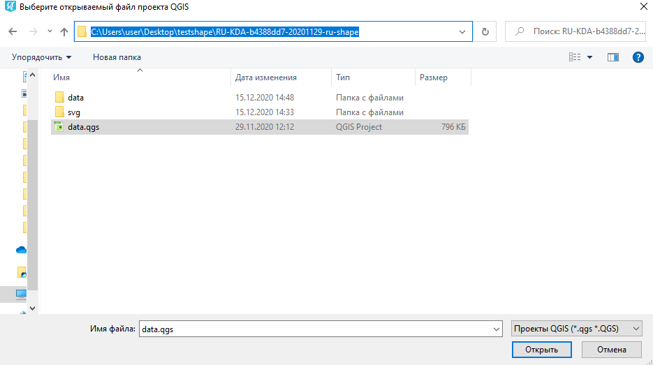
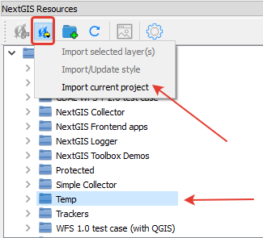

.. _data_connect_to_ngw:

Как загрузить данные в NextGIS Web (NextGIS Connect)
===================================================

* `Закажите данные <https://data.nextgis.com/ru/>`_ на интересующую Вас территорию в формате ESRI Shape (QGIS).
* Дождитесь получения результата, скачайте, распакуйте архив с данными.
* Скачайте и установите `NextGIS QGIS <https://nextgis.ru/nextgis-qgis/>`_.
* Запустите NextGIS QGIS. Чтобы открыть полученные данные, нажмите на Меню - Проекты - Открыть проект. Перейдите в папку с заказом - Откройте файл data.qgs.
В результате проект будет полностью загружен в NextGIS QGIS.

   
* Установите модуль **NextGIS Connect** (Меню - Модули -Управление модулями - Ввести в поиске *NextGIS Connect* - Установить)

.. figure:: _static/search_ngconnect.png
   :name: search_ngconnect
   :align: center
   :width: 16cm

* Появится панель модуля NextGIS Connect. Также панель можно открыть при помощи кнопки |connect_icon| на панели инструментов. 

* Настройте подключение к вашей веб ГИС:

1. Нажмите на кнопку настроек |settings_icon_connect|

2. В открывшейся панели Соединений создайте новое подключение (укажите URL вашей веб ГИС и при необходимости логин/пароль пользователя веб ГИС). 

3. Нажмите *Ok/, откроется диалог с настроенным соединением. Закройте его. В панели модуля появятся все ресурсы вашей веб ГИС.

    

4. Выберите *группу ресурсов*, в которую вы хотите поместить ваш проект, нажмите на кнопку *Добавить в веб ГИС* в панели модуля и *импортируйте* текущий проект.
В течение некоторого времени откроется веб-карта с настроенным проектом/

