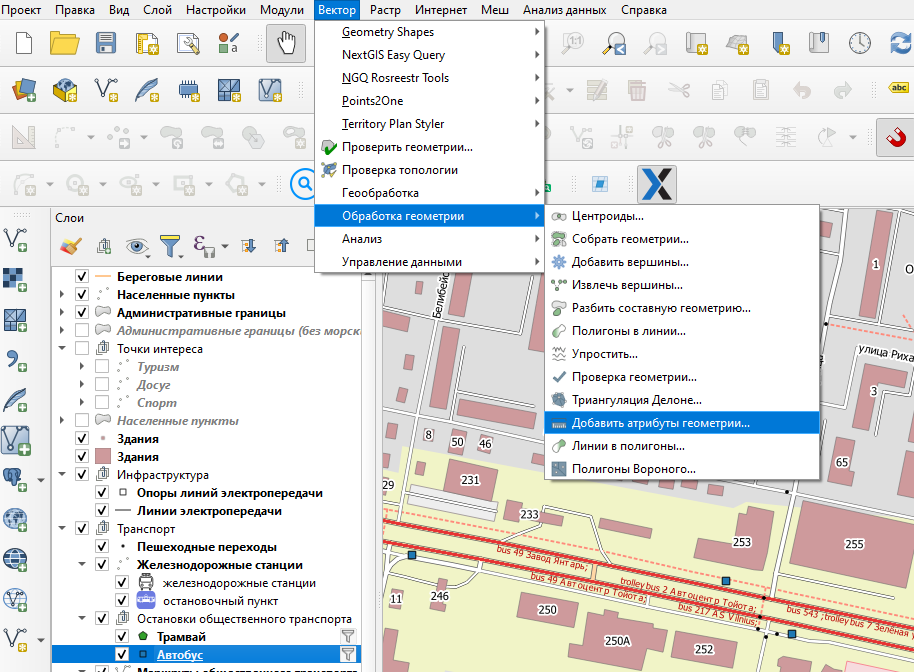
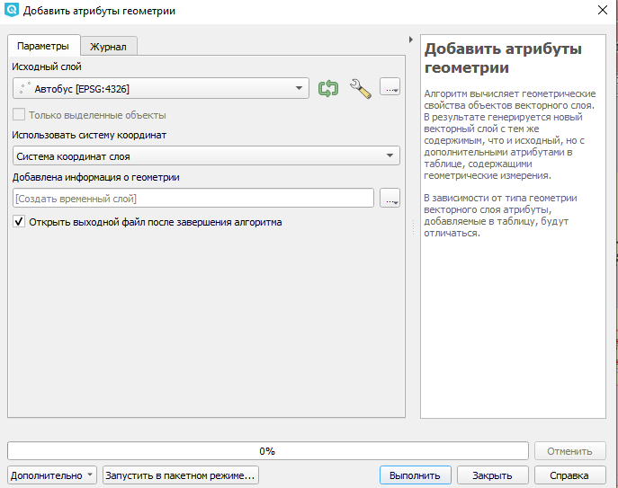
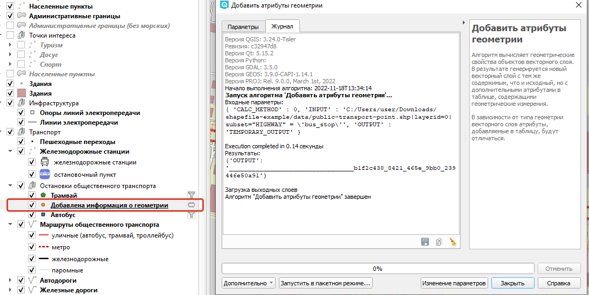

.. _data_coord:

Как получить координаты объектов точечного слоя
===============================================

* `Закажите данные <https://data.nextgis.com/ru/>`_ на интересующую Вас территорию, например, в формате GeoJSON.
* Дождитесь получения результата, скачайте, распакуйте архив с данными.
* Откройте полученный `проект <https://data.nextgis.com/ru/howto/open_map/>`_ и выделите нужный вам слой
* Откройте инструмент ``Добавить аттрибуты геометрии`` (верхнее меню Вектор > Обработка геометрии)

   
* Откроется окно инстhумента, где слой из списка уже выбран. При необходимости укажите другой или запустите в пакетном режиме. Укажите систему координат. Результат можно записать как во временный слой, так и в локальный файл

   
* После выполнения алгоритма будет создан новый слой, содержащий все атрибуты исходного + 2 новых стобца с координатам x и y.

   
 .. figure:: _static/new_layer_attr.png
   :name: coord1
   :align: center
   :width: 16cm
