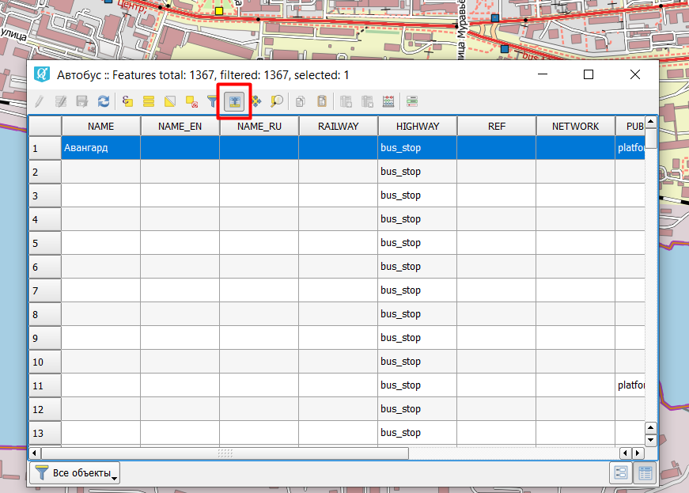
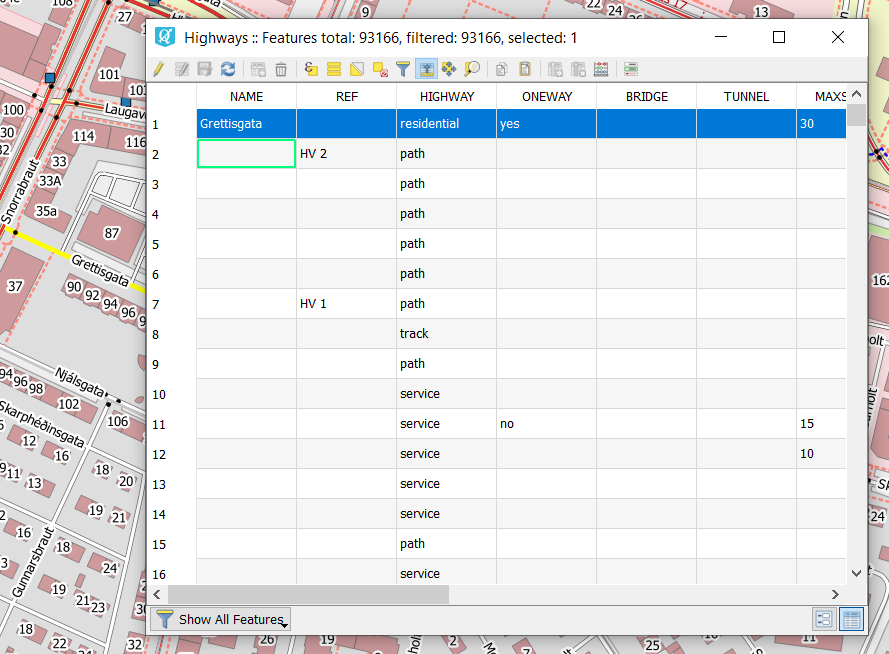
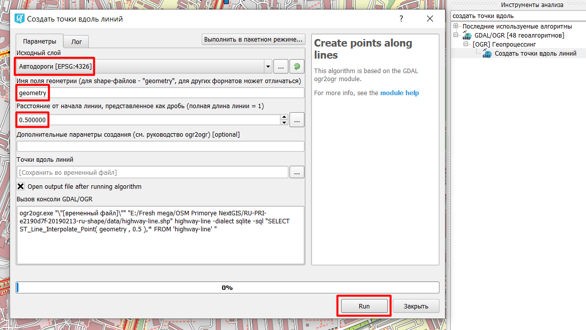

.. _data_coord:

Как получить координаты определенного объекта
===========================

* `Закажите данные <https://data.nextgis.com/ru/>`_ на интересующую Вас территорию, например, в формате GeoJSON.
* Дождитесь получения результата, скачайте, распакуйте архив с данными.
* Откройте слой, содержащий искомый объект, в одной из ГИС (в качестве примера далее рассмотрена работа в `NextGIS QGIS <https://nextgis.ru/nextgis-qgis/>`_). Найдите искомый объект на карте (или в таблице атрибутов) и выделите его. В рассматриваемом примере выбранный точечный объект подсвечен желтым цветом на карте и синим - в таблице атрибутов. Для быстрого обнаружения в таблице атрибутов выбранного через карту объекта можно воспользоваться кнопкой «Переместить выделенные в начало»

* Не снимая выделения в таблице атрибутов, нажмите сочетание клавиш Ctrl + C (это позволит скопировать все атрибуты выбранного объекта) и далее вставьте скопированную информацию в любой текстовый или табличный редактор. В самом первом столбце «wkt_geom» будут отображены координаты одной или нескольких точек (если объект - линия или полигон), принадлежащих объекту интереса.

.. figure:: _static/coord2.png
   :name: coord2
   :align: center
   :width: 16cm
   
* При необходимости можно получить координаты середины линейного объекта. Для этого в панели слоев выделите слой, содержащий объект интереса, и на карте (или через Таблицу атрибутов) выделите непосредственно сам объект.

   
* Далее в панели инструментов (для отображения нажмите Ctrl+Alt+T) через поиск найдите и выберите алгоритм GDAL/OGR «Создать точки вдоль линий». В открывшемся окне в качестве исходного слоя выберите слой, содержащий объект интереса. Для shape-файлов в «Имя поля геометрии» укажите «geometry». В поле «Расстояние от начала линии, представленное как дробь», укажите «0.5». Нажмите «Run». 

   
* В результате создается слой с точкой, которая находится ровно посередине объекта, получение ее координат аналогично описанному выше.

.. figure:: _static/coord5.png
   :name: coord5
   :align: center
   :width: 16cm
   
* При необходимости можно получить координаты центра полигонального объекта. Для этого установите модуль realcentroid. Далее выберите искомый объект на карте или в таблице атрибутов. Зайдите в модуль realcentroid, укажите слой, который содержит требуемый полигон, поставьте галочки напротив «Selected features only» и «Add to map canvas», укажите имя и путь к создаваемому точечному слою. 

.. figure:: _static/coord6.png
   :name: coord6
   :align: center
   :width: 16cm
   
В результате создается слой с одной точкой (если был выбран один полигон), получение ее координат аналогично описанному выше.
