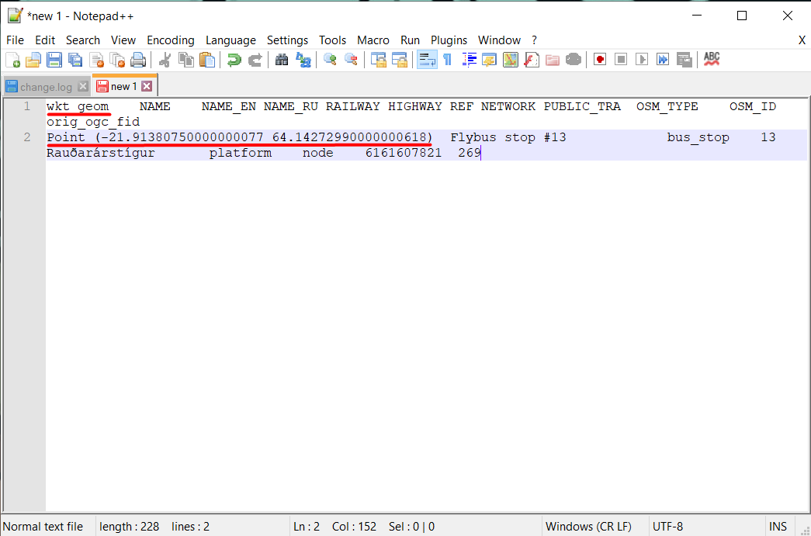
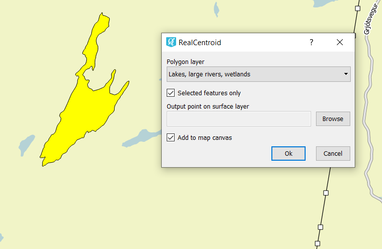

.. _data_coord:

How to get coordinates of a target object
===========================

* `Order data <https://data.nextgis.com/en/>`_ for your area of interest, e.g. in GeoJSON format.
* Wait for email with download link, download and unpack archive with data.
* Add a layer with target object to `QGIS <https://qgis.org>`_). 
* Find target object on the map (or through attribute table) and select it. Selected point object is highlighted with yellow on the map and with blue – in attribute table. If you selected an object through the map, use “Move selection to top” button to locate it in attribute table.

.. figure:: _static/coord1.png
   :name: coord1
   :align: center
   :width: 16cm

* Do not deselect feature in attribute table and press “Ctrl + C” (it allows to copy all attributes of a target object) and then paste it into any text or table editor or processor. In a very first column named “wkt_geom” you will find coordinates of one or several points (if your target object is a line or polygon), belonging to the object.

   
* If desired it is possible to get coordinates of the middle of a line object. Select target object through the map or attribute table.

.. figure:: _static/coord3.png
   :name: coord3
   :align: center
   :width: 16cm
 
* Then in a Toolbox Panel (press “Ctrl+Alt+T” to display) find and select GDAL/OGR algorithm “Create points along lines”. In pop-up window choose a layer with a target object as an “Input layer”. For shapefiles set “geometry” into “Geometry column name” field. Set “0.5” into “Distance from line start…” field. Press “Run”.

.. figure:: _static/coord4.png
   :name: coord4
   :align: center
   :width: 16cm
   
* As a result new layer is created with a point located exactly in a middle of target line. To get point’s coordinates please see instruction above.

   
* If desired it is possible to get coordinates of the center of a polygon object. Install plugin “realcentroid”. Then select target object through the map or attribute table. Launch “realcentroid” plugin. In pop-up window set layer with a target object, check boxes “Selected features only” and “Add to map canvas”, set name and path for output layer.

   
* As a result new layer is created with a point located in a centre of target polygon. To get point’s coordinates please see instruction above.
