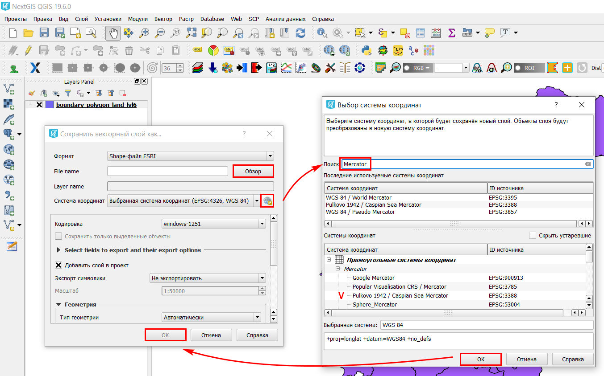

.. _data_cs_change:

How to change coordinate reference system of the data
===========================

* `Order data <https://data.nextgis.com/en/>`_ for your area of interest, e.g. in GeoJSON (QGIS) format.
* Wait for an email with the download link. Download and unpack the data.
* Import the target layer, which coordinate reference system you'd like to change, in `QGIS <https://qgis.org/en/site/forusers/download.html>`_. 
* Right-click on a target layer in Layers Panel, select option “Save as…”. Thus you’ll create a copy of the layer, but in desired coordinate reference system.

* In pop-up window set a name and a path to a new file. To select its coordinate reference system press “Select CRS” button. One more pop-up window will appear; type either key words or EPSG code into “Filter” field, it is the easiest way to select desired coordinate reference system. Press “OK” in both windows.

* New layer in desired coordinate reference system is created and added to the project. Check of coordinate reference system is available via layer’s properties.

.. figure:: _static/cs_change3.png
   :name: cs_change3
   :align: center
   :width: 16cm
