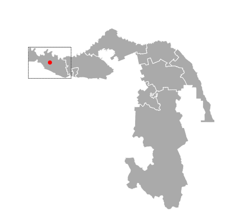

.. _data_d3:

Как подключить данные в D3 (d3.js)
==================================

* `Закажите данные <https://data.nextgis.com/ru/>`_ на интересующую Вас территорию в формате GeoJSON.
* Дождитесь получения результата, скачайте, распакуйте архив с данными.
* Выберите нужный слой, например Границы муниципальных районов (boundary-polygon-lvl6.geojson)
* Чтобы подключить слой в D3, нужно его захостить (положить туда, где он будут доступен по гиперссылке).

Код описывающий простую карту, включающую слой муниципальных районов, выглядит следующим образом:

.. code-block:: html

  <!DOCTYPE html>
  <html>
  
    <head>
      <meta charset="utf-8" />
      <meta name="viewport" content="width=device-width, initial-scale=1" />
      <title>Show Data layer on the D3</title>

    
    
  </head>

  <body>
    

      <svg width="620px" height="600px">
        <g class="map"></g>
      </svg>
    

    
  </body>
 </html>

Расширенный пример можно посмотреть `здесь <https://codepen.io/rendrom/pen/wvrbNMK>`_.

Результат:

