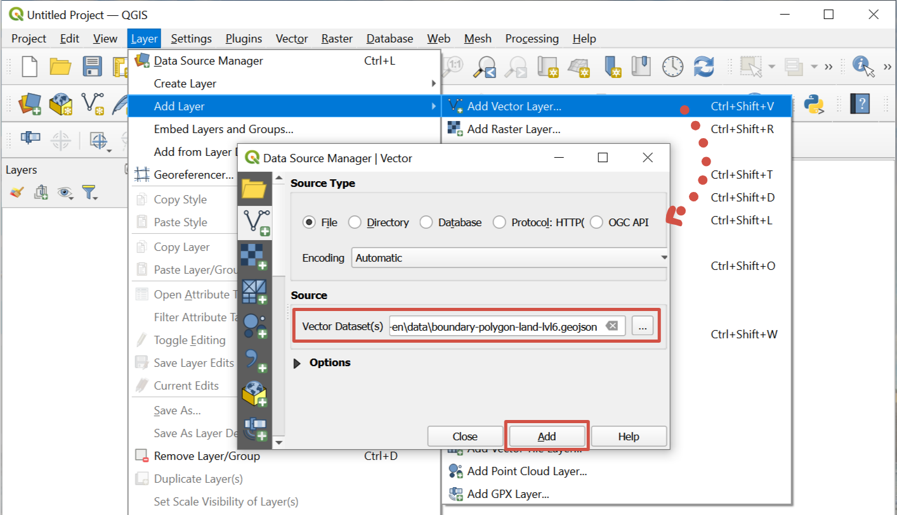
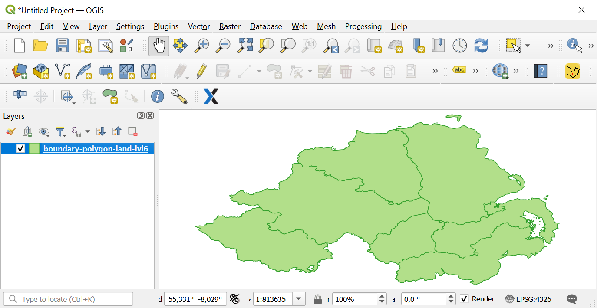
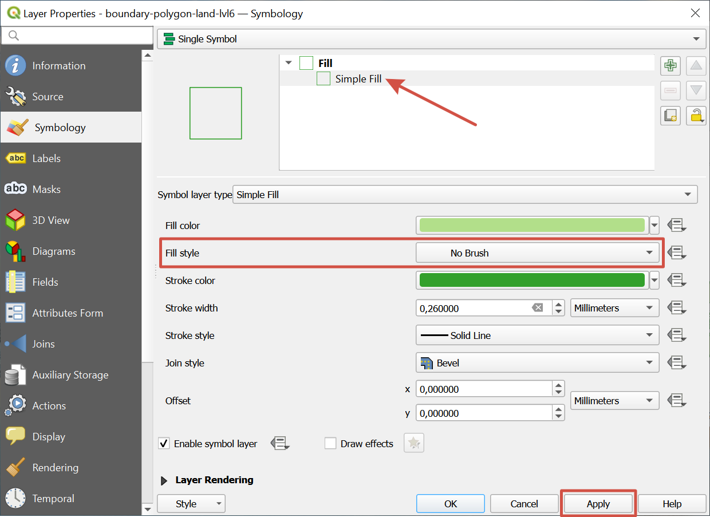

.. _data_district:

How to get municipal boundaries for a target region
===================================================

* `Order data <https://data.nextgis.com/en/>`_ for your area of interest, for example in GeoPackage format.
* Wait for an email with the download link. Download and unpack the data.
* Launch QGIS and in the main menu select “Layer” > “Add Layer” > “Add Vector Layer…”. In a pop-up window from downloaded folder “data” select file “boundary-polygon-land-lvl6”.

   Adding layer from GeoJSON file

* Municipalities’ boundaries are imported in GIS.

   
* If you want municipalities to be shown as outlines, right-click on a layer and select “Properties”. In pop-up window select Symbology > Simple fill > Fill style=“No Brush” and press **Apply**.

.. note::

   Types and levels of administrative boundaries differ from country to country. Thus file “boundary-polygon-land-lvl6” can refer to various levels of administrative division, depending on particular country. To find out about your area of interest please check `here <https://wiki.openstreetmap.org/wiki/Tag:boundary%3Dadministrative>`_.
