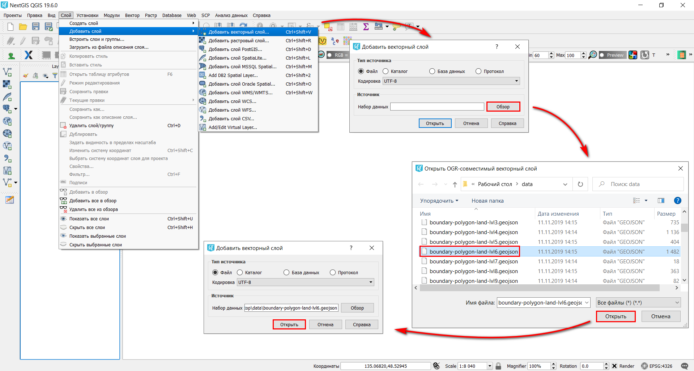
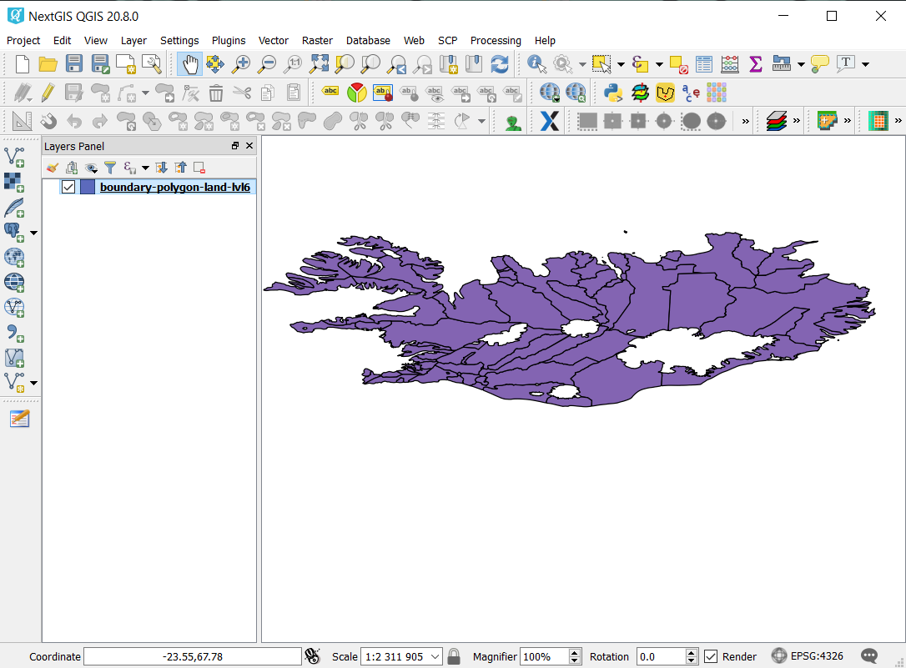

.. _data_district:

Как получить границы районов для конкретного региона
===========================

* `Закажите данные <https://data.nextgis.com/ru/>`_ на интересующую Вас территорию в формате GeoJSON.
* Дождитесь получения результата, скачайте, распакуйте архив с данными.
* Запустите ГИС (в данном примере - приложение `NextGIS QGIS <https://nextgis.ru/nextgis-qgis/>`_) и в главной панели меню выберите «Слой» > «Добавить слой» > «Добавить векторный слой». В открывшемся окне выберите файл «boundary-polygon-land-lvl6.geojson», который находится в загруженной папке «data».

* Границы районов добавлены в ГИС.

   
* Если Вы хотите, чтобы границы районов отображались только контурами, щелкнув правой кнопкой мыши по слою, выберите «Свойства». В открывшемся окне выберите «Стиль» > «Простая заливка» > «Без заливки» и нажмите «Применить».

.. figure:: _static/district3.png
   :name: district3
   :align: center
   :width: 16cm

.. note::

   Файл «boundary-polygon-land-lvl6.geojson» содержит информацию о муниципальных районах и городских округах - то, что наиболее часто называют районами или административными районами.
   Файл «boundary-polygon-land-lvl8.geojson» содержит информацию о сельских поселениях и городских поселениях.
   Файл «boundary-polygon-land-lvl9.geojson» содержит информацию о внутригородских районах.
   Подробней об обозначении административных уровней в Российской Федерации (и не только) можно почитать |location_link|.

.. |location_link| raw:: html

   <a href="https://wiki.openstreetmap.org/wiki/RU:Tag:boundary%3Dadministrative#.D0.90.D0.B4.D0.BC.D0.B8.D0.BD.D0.B8.D1.81.D1.82.D1.80.D0.B0.D1.82.D0.B8.D0.B2.D0.BD.D1.8B.D0.B5_.D1.83.D1.80.D0.BE.D0.B2.D0.BD.D0.B8_.28admin_level.29_.D0.B2_.D0.A0.D0.BE.D1.81.D1.81.D0.B8.D0.B9.D1.81.D0.BA.D0.BE.D0.B9_.D0.A4.D0.B5.D0.B4.D0.B5.D1.80.D0.B0.D1.86.D0.B8.D0.B8" target="_blank">здесь</a>
