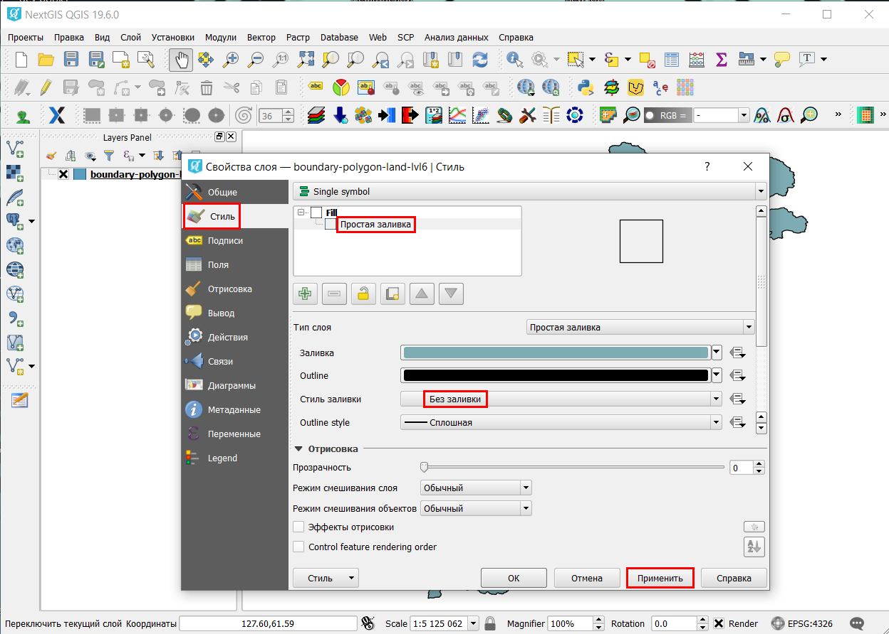

.. _data_district:

How to get municipalities’ boundaries for target region
===========================

* `Order data <https://data.nextgis.com/en/>`_ for your area of interest in GeoJSON format.
* Wait for email with download link, download and unpack archive with data.
* Launch GIS (below is described usage of `NextGIS QGIS <https://nextgis.com/nextgis-qgis/>`_) and in a main menu select “Layer” > “Add Layer” > “Add Vector Layer…”. In pop-up window from downloaded folder “data” select file “boundary-polygon-land-lvl6.geojson” (in our example it corresponds to municipalities in Iceland).

.. figure:: _static/district1.png
   :name: district1
   :align: center
   :width: 16cm

* Municipalities’ boundaries are imported in GIS.

.. figure:: _static/district2.png
   :name: district2
   :align: center
   :width: 16cm
   
* If you want municipalities to be shown as outlines, right-click on a layer and select “Properties”. In pop-up window select “Style” > “Simple fill” > “No Brush” and press “Apply”.

.. note::

   Types and levels of administrative boundaries differ from country to country. Thus file “boundary-polygon-land-lvl6.geojson” can refer to various levels of administrative division, depending on particular country. To find out about your area of interest please check `here <https://wiki.openstreetmap.org/wiki/Tag:boundary%3Dadministrative>`_.
