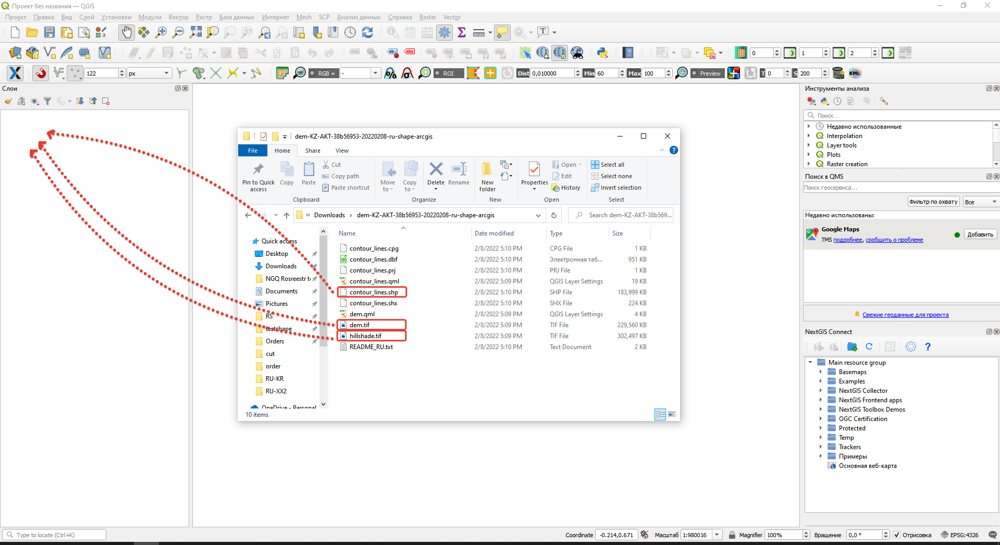
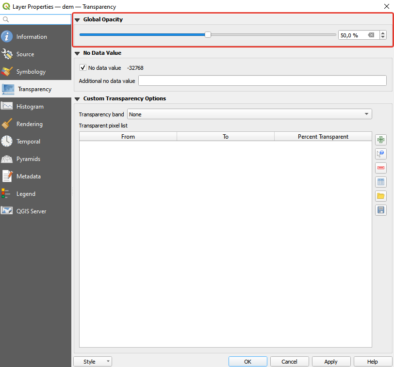
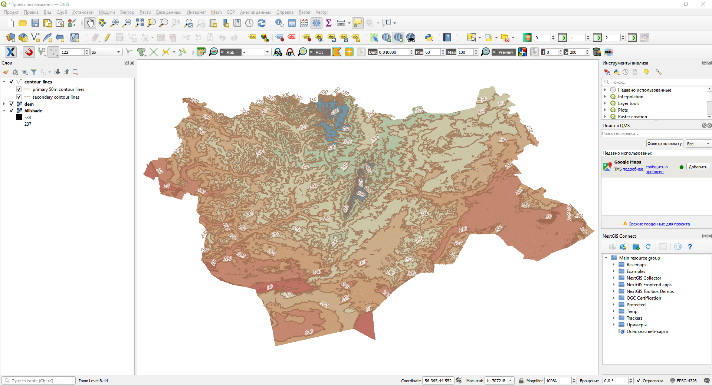

.. _data_elev_to_qgis:

How to open elevation data in QGIS
====================================

* `Order elevation data <https://data.nextgis.com/en/>`_ for your area of interest, e.g. in ESRI Shape (QGIS) and GeoTIFF format choosing the step of contour lines.
* Wait for email with download link, download and unpack archive with data.
* Download and install `QGIS <https://qgis.org/en/site/forusers/download.html/>`_.
* Launch QGIS.
* Drag and drop **hillshade.tif**, **dem.tif** and **contour_lines.shp** from the unpacked data folder to QGIS interface.

* Arrange the layers in the list in the most convenient way to work from top to bottom: Contours, DEM, hillshade.
* Set the layer properties **dem** transparency to 50%

Detailed video **How to open elevation data in QGIS** - can be viewed `here <https://youtu.be/pwfJy5o5BmU/>`_
