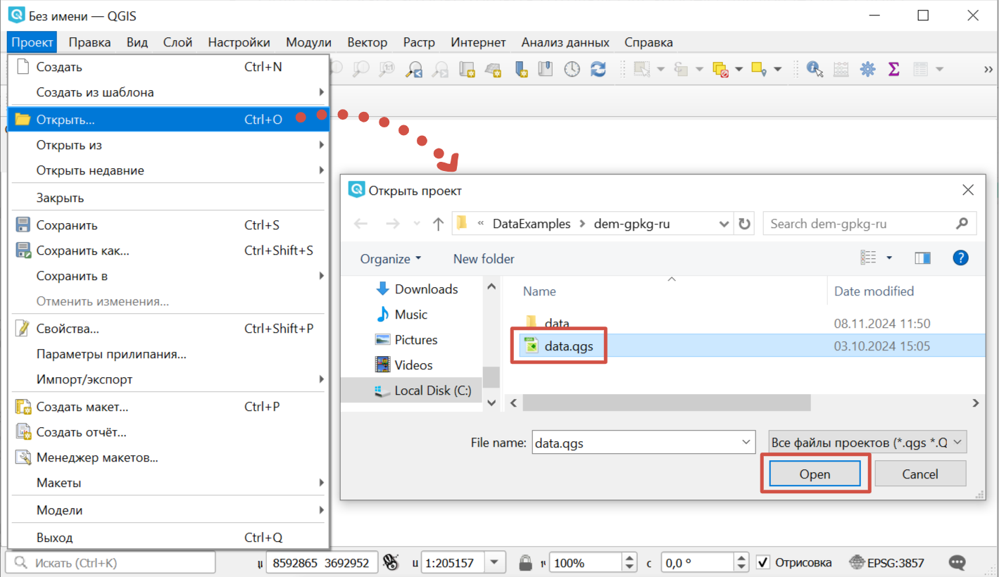
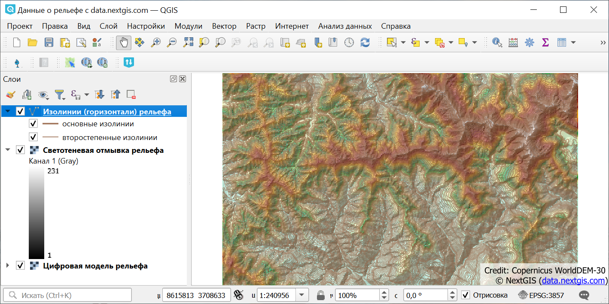

.. _data_elev_to_qgis:

Как загрузить данные рельефа в QGIS
====================================

* `Закажите данные <https://data.nextgis.com/ru/>`_ рельефа на интересующую Вас территорию в нужном формате с указанием шага изолиний.
* Дождитесь получения результата, скачайте, **распакуйте** архив с данными.
* Скачайте и установите `NextGIS QGIS <https://nextgis.ru/nextgis-qgis/>`_ или обычный `QGIS <https://qgis.org/>`_.
* Запустите QGIS.
* Чтобы открыть готовый ГИС-проект (включает все слои с настроенными стилями), нажмите «Проекты» > «Открыть» и в появившемся окне выберите сохраненный файл «data.qgs».

* Проект будет добавлен в QGIS; данные готовы к работе.

   

Также вы можете добавить данные рельефа в уже существующий проект:

* Перетащите из папки с распакованными данными в интерфейс QGIS файлы **hillshade.tif** (светотеневая отмывка), **dem.tif** (цифровая модель рельефа) и **contour_lines** (изолинии рельефа, расширение файла зависит от выбранного векторного формата, например, если вы заказали Shape, то .SHP).

.. figure:: _static/elev_files_ngqgis_ru.png
   :name: elev_files_qgis
   :align: center
   :width: 20cm
   
* Расположите слои в списке сверху вниз: 

#. Изолинии
#. Светотеневая отмывка
#. Цифровая модель рельефа

Подробное видео **Как открыть данные рельефа в QGIS** - можно посмотреть `здесь <https://youtu.be/pwfJy5o5BmU/>`_.
