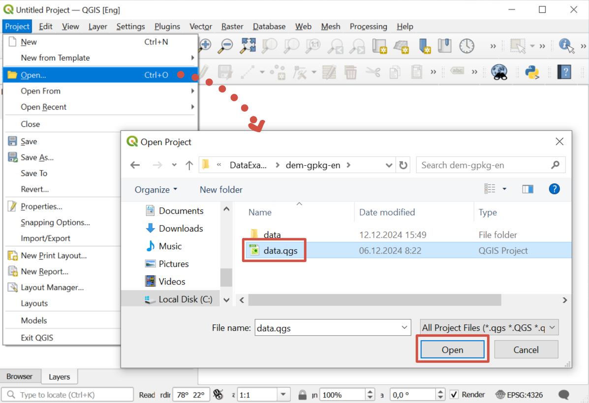
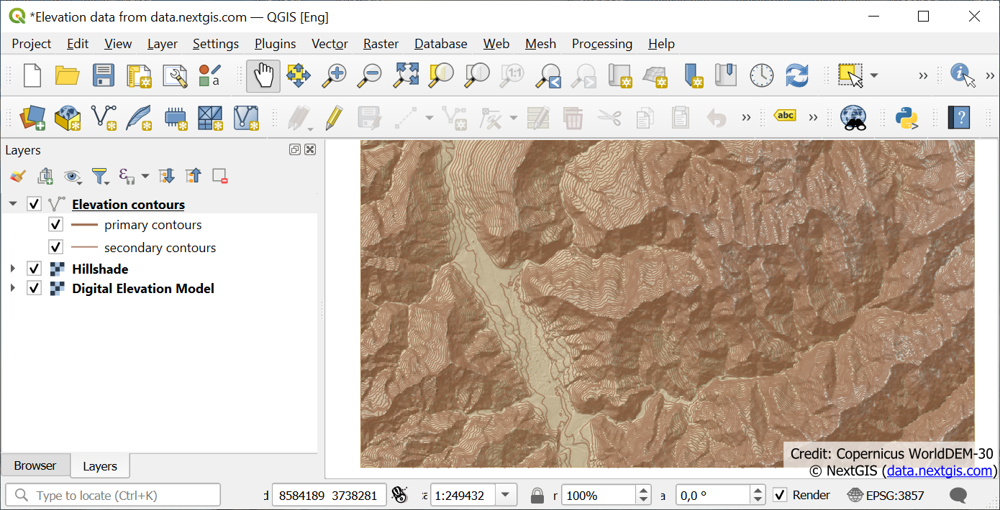
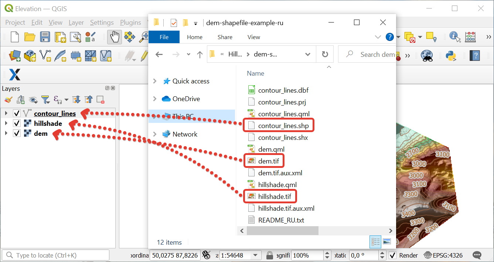

.. _data_elev_to_qgis:

How to open elevation data in QGIS
====================================

* `Order elevation data <https://data.nextgis.com/en/>`_ for your area of interest, e.g. in GeoPackage (QGIS) and GeoTIFF format choosing the step of contour lines.
* Go to the `orders <https://data.nextgis.com/en/orders/actual/>`_ page and download the archive when it's complete.
* **Unpack** the archive.
* Download and install `QGIS <https://qgis.org/en/site/forusers/download.html>`_.
* Launch QGIS.
* To open a preset GIS project (which includes all layers with customized styles), click “Project” > “Open” and in pop-up window select the saved file “data.qgs”.

* The project will be added to QGIS; data is ready to go.

You can also add elevation data as files to an existing project.

* Drag and drop the following files from the unpacked data folder to QGIS interface: **hillshade.tif**, **dem.tif** and **contour_lines** (extention depends on the file type, for example if you purchased Shape file, you'll need contour_lines.shp).

* Arrange the layers in the list in the most convenient way to work from top to bottom: 

#. Contours
#. Hillshade
#. DEM

Detailed video **How to open elevation data in QGIS** - can be viewed `here <https://youtu.be/pwfJy5o5BmU/>`_
