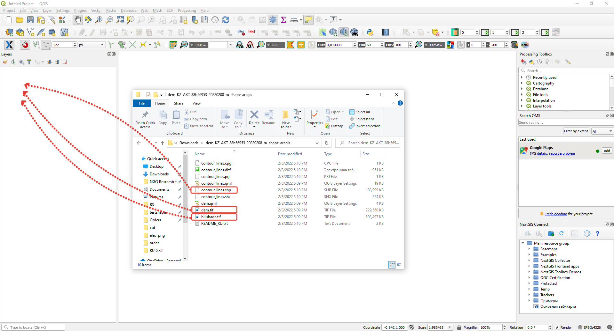

.. _data_elev_to_qgis:

Как загрузить данные рельефа в QGIS
====================================

* `Закажите данные <https://data.nextgis.com/ru/>`_ рельефа на интересующую Вас территорию в формате ESRI Shape (QGIS) и GeoTIFF с указанием шага изолиний.
* Дождитесь получения результата, скачайте, распакуйте архив с данными.
* Скачайте и установите `QGIS <https://qgis.org/en/site/forusers/download.html/>`_.
* Запустите QGIS.
* Перетащите из папки с распакованными данными файлы **hillshade.tif** (светотеневая отмывка), **dem.tif** (цифровая модель рельефа) и **contour_lines.shp** (изолинии рельефа) в интерфейс QGIS.

* Расположите слои в списке наиболее удобным для работы образом сверху вниз: Изолинии, ЦМР, отмывка.
* Установите в свойствах слоя **dem** прозрачность на 50%

.. figure:: _static/elev_transp_qgis.png
   :name: elev_transp_qgis
   :align: center
   :width: 16cm

.. figure:: _static/elev_qgis_project.png
   :name: elev_qgis_project
   :align: center
   :width: 16cm

Подробное видео **Как открыть данные рельефа в QGIS** - можно посмотреть `здесь <https://youtu.be/pwfJy5o5BmU/>`_.
