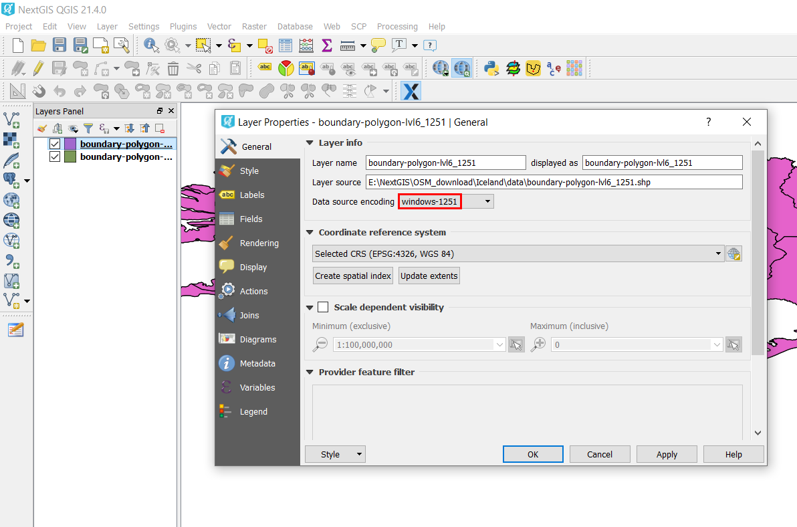

.. _data_encoding_change:

Как изменить кодировку данных
===========================

* `Закажите данные <https://data.nextgis.com/ru/>`_ на интересующую Вас территорию, например, в формате GeoJSON.
* Дождитесь получения результата, скачайте, распакуйте архив с данными.
* Откройте слой, у которого Вы хотите изменить кодировку, в одной из ГИС (в качестве примера далее рассмотрена работа в `NextGIS QGIS <https://nextgis.ru/nextgis-qgis/>`_).
* Щелкнув правой кнопкой мыши по слою в панели слоев, выберите «Сохранить как…». Таким образом Вы создадите копию слоя, но с желаемой кодировкой.

.. figure:: _static/encoding_change1.png
   :name: encoding_change1
   :align: center
   :width: 16cm

* В открывшемся окне выберите формат «Shape-файл ESRI» и желаемую кодировку (в данном примере - windows-1251), а также укажите имя нового файла.

.. figure:: _static/encoding_change2.png
   :name: encoding_change2
   :align: center
   :width: 16cm

* Будет создан новый слой с желаемой кодировкой.

