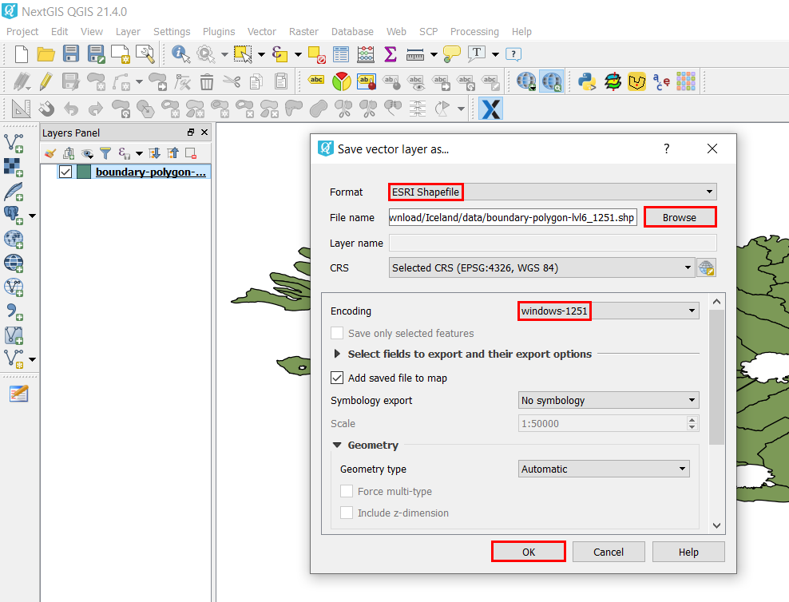

.. _data_encoding_change:

How to change data encoding
===========================

* `Order data <https://data.nextgis.com/en/>`_ for your area of interest, e.g. in GeoJSON format.
* Wait for email with download link, download and unpack archive with data.
* Import target layer, which encoding you want to change, into one of the GIS (as an example, below is the case for `NextGIS QGIS <https://nextgis.com/nextgis-qgis/>`_). 
* Right-click on a target layer in Layers Panel, select option “Save as…”. Thus you’ll create a copy of the layer, but in desired encoding.

.. figure:: _static/encoding_change1.png
   :name: encoding_change1
   :align: center
   :width: 16cm

* In the pop-up window select format "ESRI Shapefile" and the desired encoding (in this example - windows-1251), and also specify a name and a path to a new file. Press “OK”.

* A new layer with the desired encoding will be created. 

.. figure:: _static/encoding_change3.png
   :name: encoding_change3
   :align: center
   :width: 16cm
