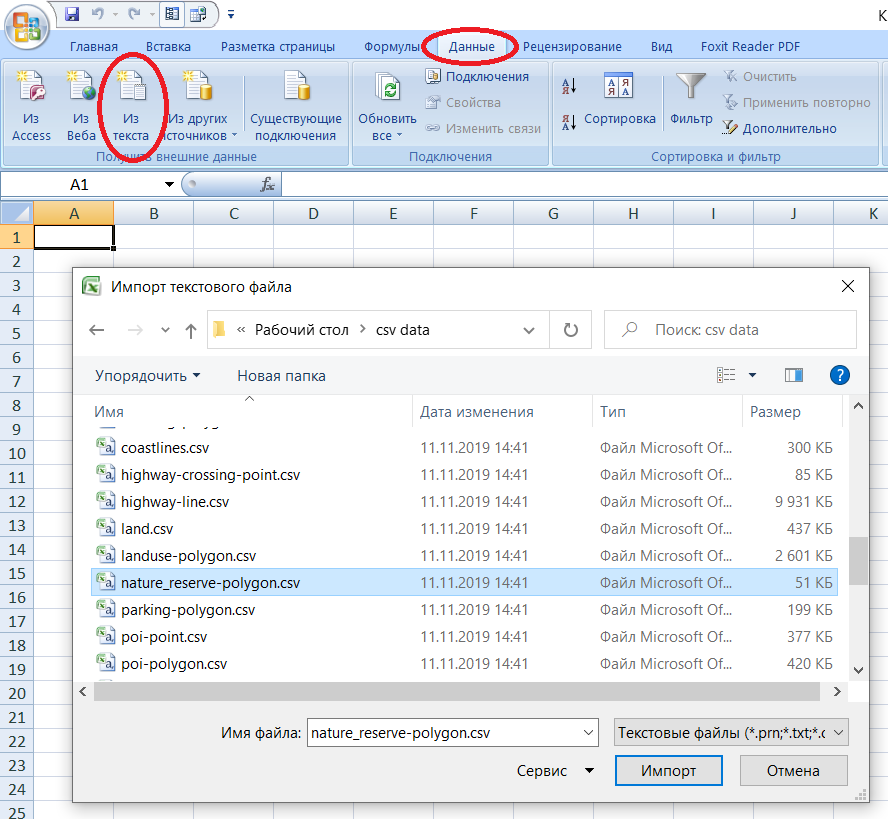
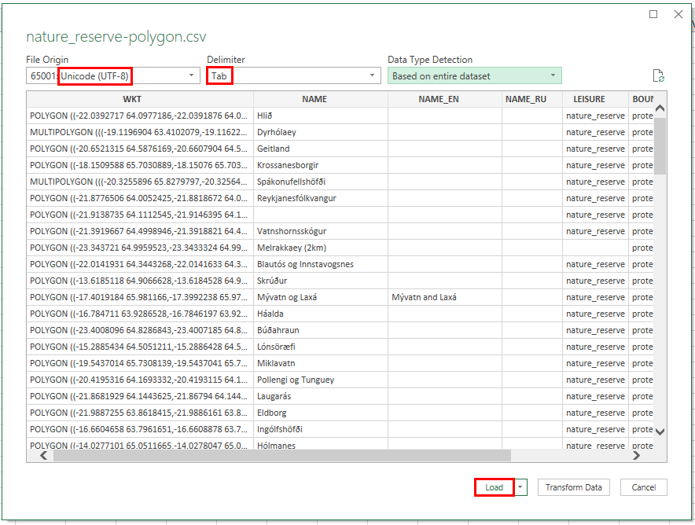
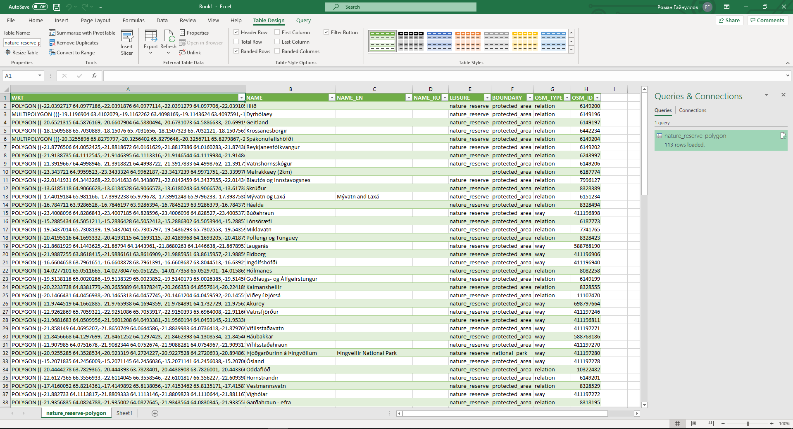
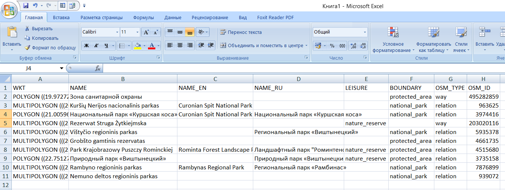

.. _data_excel:

Как открыть данные в Excel
===========================

* `Закажите данные <https://data.nextgis.com/ru/>`_ на интересующую Вас территорию в формате CSV.
* Дождитесь получения результата, скачайте, распакуйте архив с данными.
* Запустите Excel. Выберите вкладку «Данные» > «Из текста» и в появившемся окне найдите желаемый слой в формате CSV, нажмите «Импорт».

* В новом окне «Мастер текстов» укажите формат данных - «с разделителями», формат файла - «Юникод (UTF-8)», нажмите «Далее». На следующем шаге символом-разделителем выберите «знак табуляции», затем нажмите «Готово».

   
* Данные добавлены в таблицу Excel

