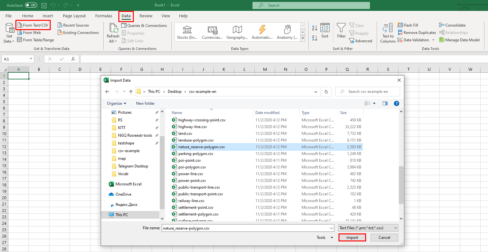

.. _data_excel:

How to open data in Excel
===================================================

* `Order data <https://data.nextgis.com/en/>`_ for your area of interest in CSV format.
* Wait for email with download link, download and unpack archive with data.
* Launch Excel. Select the "Data" tab > "From Text/CSV" and in the pop-up window find the desired layer in CSV format, click "Import".

   
* In the new window for the File Origin specify "Unicode (UTF-8)", for Delimiter - "Tab", then click "Load".

.. figure:: _static/excel2.png
   :name: excel2
   :align: center
   :width: 16cm

* Data is added to Excel spreadsheet

.. figure:: _static/excel3.png
   :name: excel3
   :align: center
   :width: 16cm
