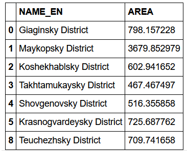

.. _data_geopandas:

How to load data in GeoPandas
=============================

* `Order data <https://data.nextgis.com/en/>`_ for your area of interest in ESRI Shape format.
* Wait for email with download link, download and unpack archive with data.
* Find out a name and a path to the target layer. For example: municipal boundaries (boundary-polygon-lvl6)
* Install and import geopandas in Python.

Showing the map:

.. code-block:: python

   import geopandas
   boundaries = geopandas.read_file("/tmp/data/boundary-polygon-lvl6.shp")
   boundaries.plot(column="oktmo")

Calculate areas:

.. code-block:: python

   boundaries["AREA"] = boundaries.to_crs("EPSG:32637").area / 10 ** 6
   boundaries[["NAME", "AREA"]]
   

