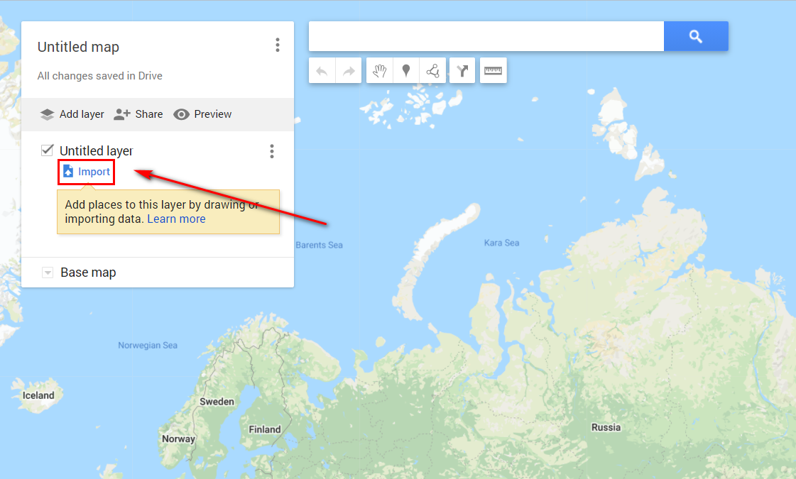
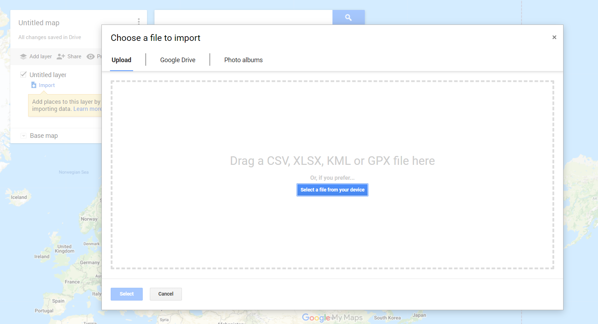
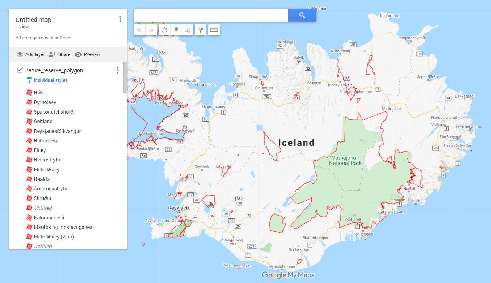

.. _data_google_mymaps:

Как загрузить данные на Google карты
===========================

* `Закажите данные <https://data.nextgis.com/ru/>`_ на интересующую Вас территорию, например, в формате GeoJSON.
* Дождитесь получения результата, скачайте, распакуйте архив с данными.
* Конвертируйте желаемый слой или слои в формат KML. Для конвертации можно воспользоваться любым онлайн конвертером, например, |location_link|.

.. |location_link| raw:: html

   <a href="https://geoconverter.hsr.ch/vector" target="_blank">GeoConverter</a>     
   
* Импортируйте полученный файл KML на карту в сервисе Google My Maps.

* Данные добавлены на карту

