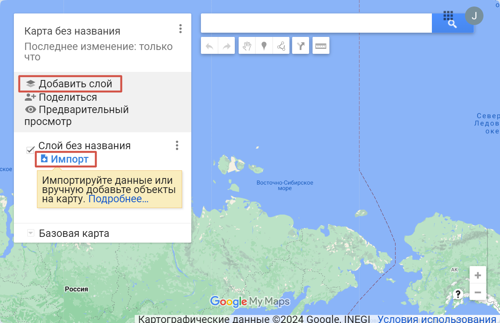
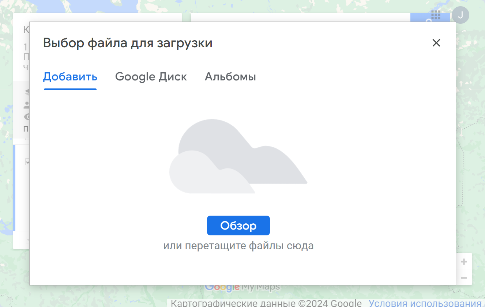
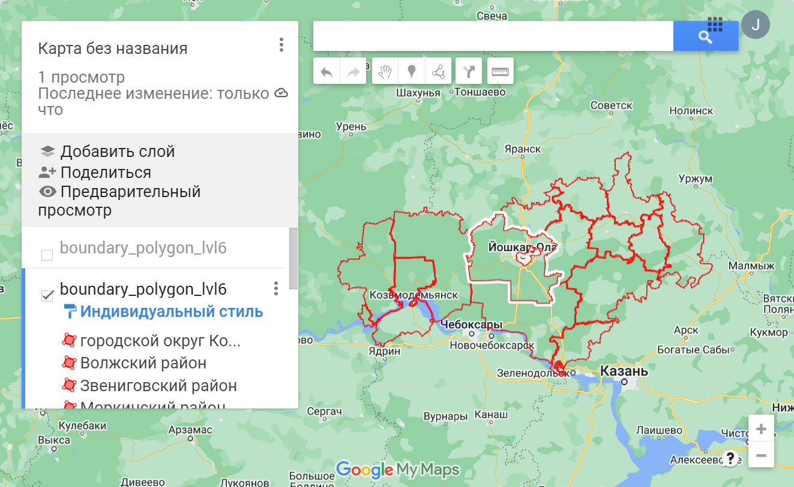

.. _data_google_mymaps:

Как загрузить данные на Google карты
===========================

* `Закажите данные <https://data.nextgis.com/ru/>`_ на интересующую Вас территорию в формате KML.
* Дождитесь получения результата, скачайте, распакуйте архив с данными.
* Импортируйте полученный файл KML на карту в сервисе Google My Maps.

* Данные добавлены на карту

