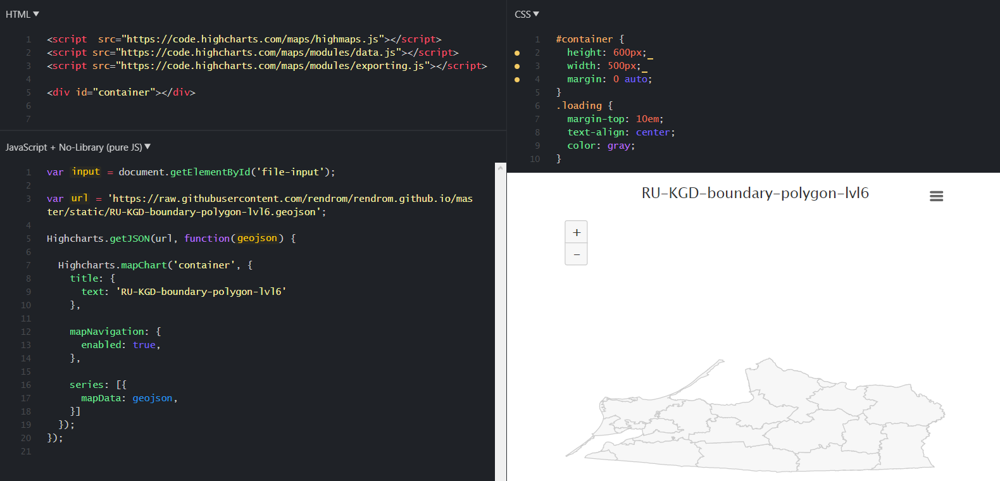

.. _data_highcharts:

Как подключить данные в Highcharts Maps (highcharts.js)
===========================

* `Закажите данные <https://data.nextgis.com/ru/>`_ на интересующую Вас территорию в формате GeoJSON.
* Дождитесь получения результата, скачайте, распакуйте архив с данными.
* Выберите нужный слой.
* Чтобы подключить данные с NextGIS Data в Highcharts Maps, нужно его захостить и указать в подключении:

.. code-block:: javascript

   Highcharts.getJSON('https://cdn.jsdelivr.net/gh/highcharts/highcharts@v7.0.0/samples/data/germany.geo.json', function (geojson)

* В документации Highcharts Maps есть много |location_link|

.. |location_link| raw:: html

   <a href="https://www.highcharts.com/demo/maps/geojson" target="_blank">примеров использования данных</a>
   , и можно посмотреть их исходный код. 

Пример использования данных NextGIS Data представлен ниже, также доступен |location_link|.

.. |location_link| raw:: html

   <a href="https://jsfiddle.net/rendrom/nhv4mu5z/" target="_blank">«живой» пример</a>

.. note::
   Библиотека Highcharts Maps хорошо подходит для быстрой визуализации статистики по пространственным данным, но для целей интерактивной картографии более подходящим выбором будут такие библиотеки как Mapbox GL JS, Openlayers и Leaflet. Посмотреть примеры подключения данных из любого json файла к этим библиотекам можно по ссылкам: https://jsfiddle.net/rendrom/a1xf63bk/ и https://jsfiddle.net/rendrom/yg6xz9kj/. В этих примерах используются библиотеки `NextGIS Frontend <https://github.com/nextgis/nextgis_frontend>`_.

.. hint::
   Для достижения лучшего по скорости и производительности результата отображения данных в Веб может оказаться полезна дополнительная генерализация, разрежение и модификация исходных данных. В результате будет получен файл меньшего размера, с меньшим количеством вершин у полигонов и линий и без лишней атрибутивной информации.
