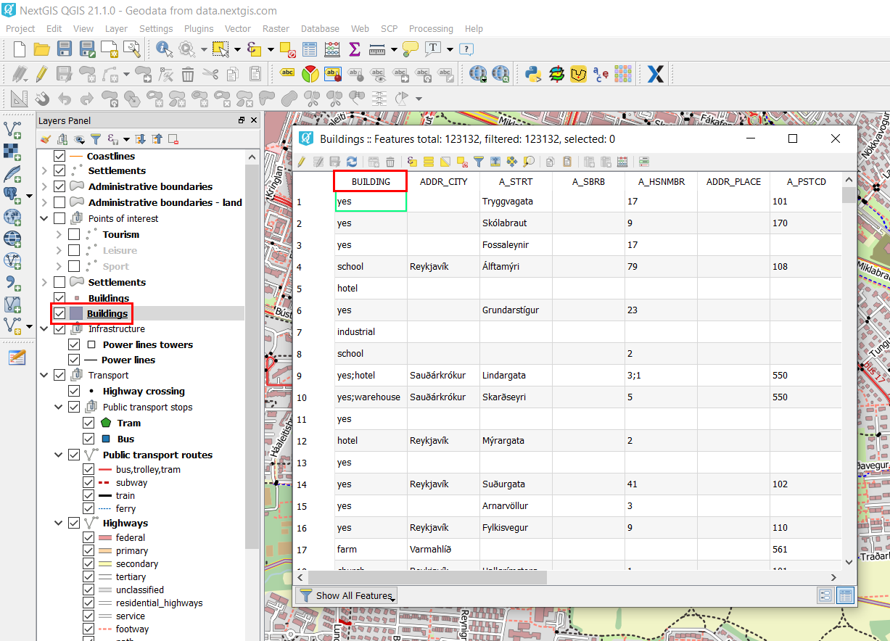
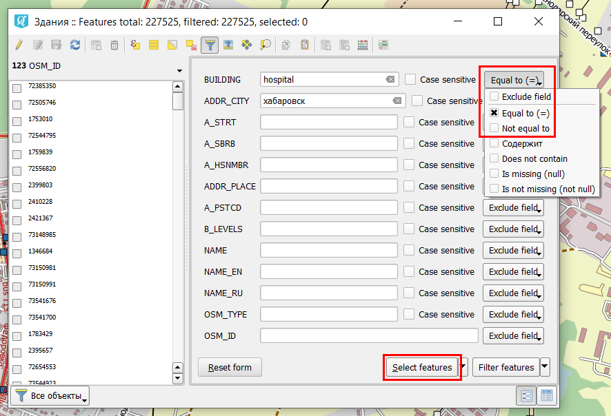
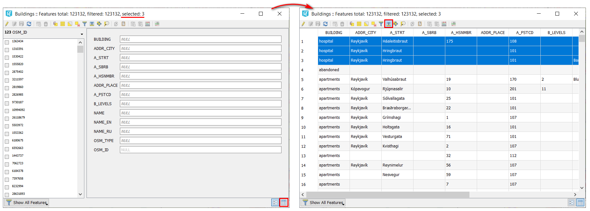

.. _data_hospital:

How to select all of my city’s hospitals on the map
===========================

* `Order data <https://data.nextgis.com/en/>`_ for your area of interest, e.g. in GeoJSON format.
* Wait for an email with the download link. Download and unpack the data.
* Open a preset GIS project in `QGIS <https://qgis.org/en/site/forusers/download.html>`_ or `NextGIS QGIS <https://nextgis.com/nextgis-qgis/>`_.
* Hospitals are a part of the "Buildings" layer. In the attribute table of this layer, the "Building" field contains information about the purpose of the building. Almost all possible types of buildings are shown in this |location_link|. From here we learn that hospitals are referred to as "hospital". 

.. |location_link| raw:: html

   <a href="https://wiki.openstreetmap.org/wiki/Key:building" target="_blank">article</a>
   

   
* In the attribute table of the layer the "ADDR_CITY" field also contains information about the settlement within which a particular object is located.

.. warning::

   |location_link1| this field is not always filled in, since it may be assumed that the belonging to a settlement can be determined from the location of the object on the map. Therefore, use this field to filter objects in the attribute table with caution.

.. |location_link1| raw:: html

   <a href="https://wiki.openstreetmap.org/wiki/Key:addr" target="_blank">However</a>
   
* In this example we want to find all hospitals in the city of Reykjavík. To do this, in the menu bar of the attribute table, click "Select / filter features using form".

.. figure:: _static/hospital2.png
   :name: hospital2
   :align: center
   :width: 16cm
   
* In the changed window in the “Building” field enter “hospital”, in the “ADDR_CITY” field - “Reykjavík”. On the right, opposite to the fields, select "Equal to (=)" in the drop-down list, then click "Select features". 

   
* Objects that meet the filter criteria will be selected both in the attribute table and on the map. For comfortable viewing , click on the "Switch to table view" button and select "Move selection to top".

   
