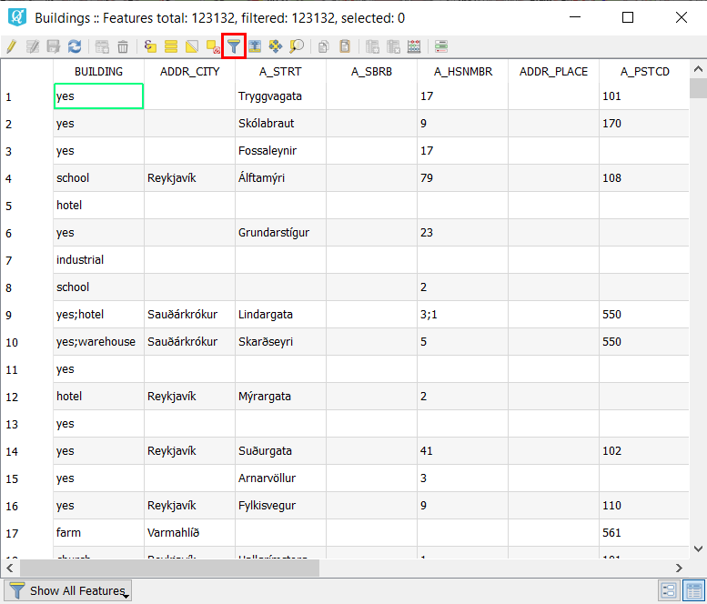
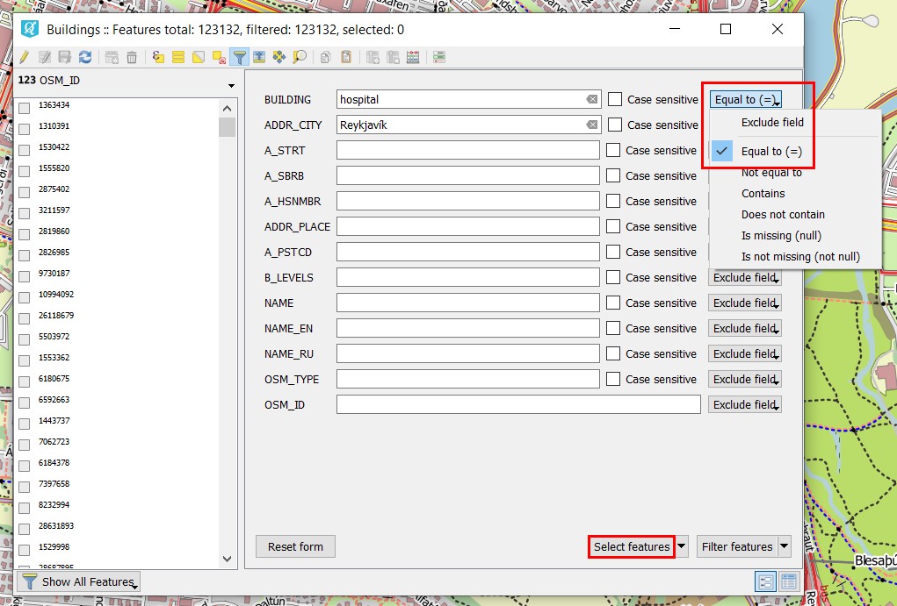

.. _data_hospital:

Как выбрать все больницы моего города на карте
===========================

* `Закажите данные <https://data.nextgis.com/ru/>`_ на интересующую Вас территорию в формате GeoJSON.
* Дождитесь получения результата, скачайте, распакуйте архив с данными.
* Откройте готовый ГИС-проект «data.qgs» в одной из ГИС (в качестве примера далее рассмотрена работа в `NextGIS QGIS <https://nextgis.ru/nextgis-qgis/>`_).
* Логично предположить, что больницы будут относиться к слою «Здания». В таблице атрибутов данного слоя поле «Building» несет в себе информацию о назначении здания. Практически все возможные типы зданий приведены в этой `статье <https://wiki.openstreetmap.org/wiki/RU:Key:building>`_. Отсюда мы узнаем, что больницы обозначаются как «hospital».

.. figure:: _static/hospital1.png
   :name: hospital1
   :align: center
   :width: 16cm

* В таблице атрибутов слоя в поле «ADDR_CITY» также содержится информация о населенном пункте, в пределах которого расположен конкретный объект. 

.. warning::

   `Однако <https://wiki.openstreetmap.org/wiki/RU:Key:addr>`_ это поле заполняется не всегда, так как может подразумеваться, что принадлежность к населенному пункту можно определить из местоположения объекта на карте. Поэтому использовать данное поле для фильтрации объектов в таблице атрибутов нужно с осторожностью.

* В этом примере мы хотим найти все больницы города Хабаровска. Для этого в панели меню таблицы атрибутов нажмите «Select/filter features using form».

   
* В изменившемся окне в поле «Building» впишите «hospital», в поле «ADDR_CITY» - «хабаровск». Справа напротив полей в выпадающем списке выберите «Equal to (=)», далее нажмите «Select features».

   
* Объекты, удовлетворяющие условиям фильтра, будут выбраны как в таблице атрибутов, так и на карте. Для удобства их просмотра нажмите на кнопку «Переключиться в режим таблицы» и в изменившемся окне выберите «Move selection to top».

