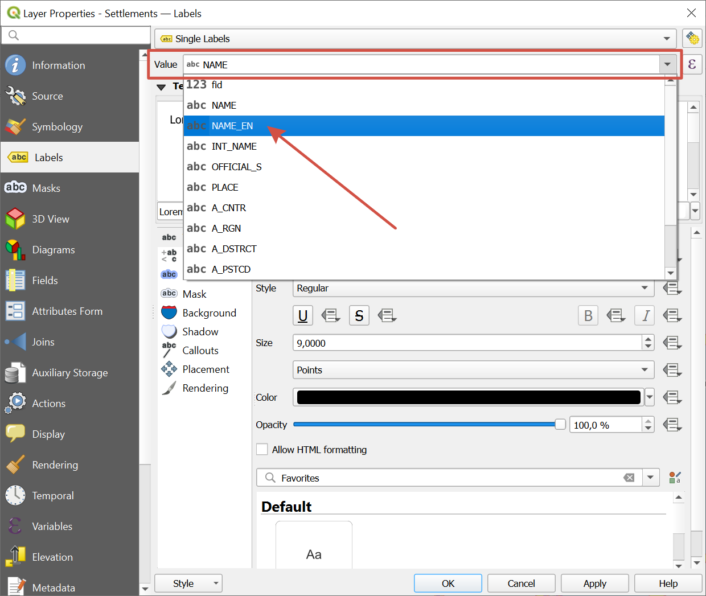

How to change the language of labels in OSM data
=================================================

*  `Order data <https://data.nextgis.com/en/>`_ for your area of interest in Geopackage (QGIS) format.
* Wait for an email with the download link. Download and **unpack** the data.
* Download and install `QGIS <https://qgis.org/en/site/forusers/download.html>`_.
* Launch QGIS and open the project file data.qgs.
* Select the layer where you want to change the label language or enable labels if they are not displayed.
* Double click the layer or use context menu to open Layer Properties. Open the **Labels** section. In the "Value" field select from a dropdown menu the correct attribute for the labels.

In the OSM data structure the attributes are:

* NAME - name in the local language
* NAME_EN - name in English
If the local name is in English itself, the other attribute may be empty.
