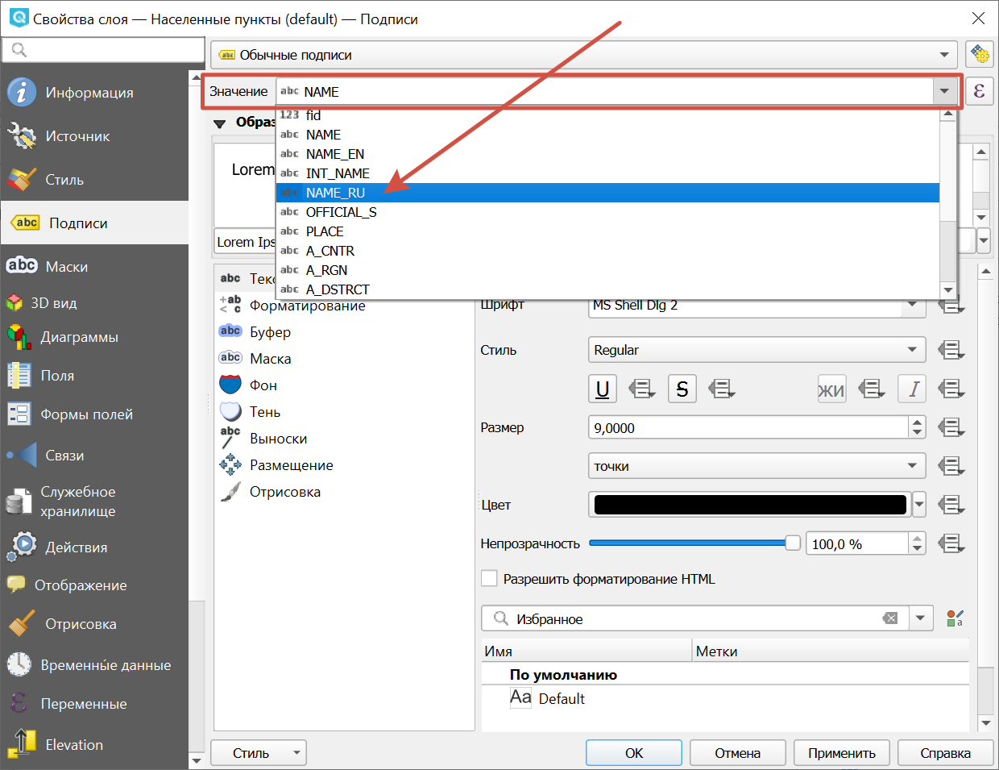

Как изменить язык подписей объектов в данных OSM
=================================================

* `Закажите данные <https://data.nextgis.com/ru/>`_ на интересующую Вас территорию в формате Geopackage (QGIS).
* Дождитесь получения результата, `скачайте <https://data.nextgis.com/ru/orders/actual/>`_ и **распакуйте** архив с данными.
* Скачайте и установите `NextGIS QGIS <https://nextgis.ru/nextgis-qgis/>`_, можно также использовать обычный QGIS.
* Запустите QGIS и откройте файл проекта data.qgs.
* Выберите слой, для которого хотите поменять язык подписей или включить их, если они не отображаются.
* Двойным кликом по слою или через контекстное меню откройте свойства слоя. Перейдите во вкладку **Подписи**. В поле "Значение" в выпадающем меню выберите, из какого поля будут братся тексты подписей.

В структуре данных OSM предлагаются следующие варианты:

* NAME - название на локальном языке. Обратите внимание, что названия в этом атрибуте будут на языке, преобладающем в регионе. Например, в Болгарии - на болгарском, кирилицей.
* NAME_EN - на английском.
* NAME_RU - на русском (доступно в выгрузках, заказанных через версию сайта с оплатой в рублях)
