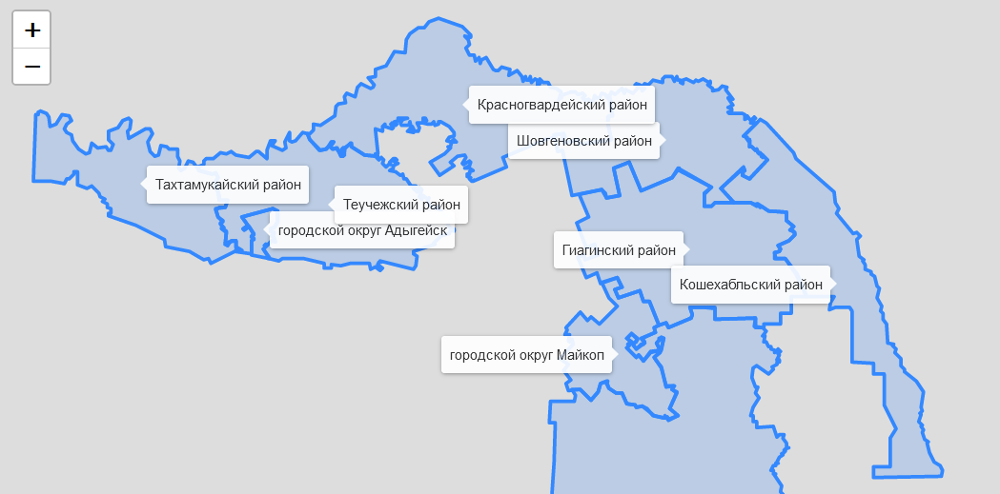

.. _data_leaflet:

Как подключить данные в Leaflet (leaflet.js)
============================================

* `Закажите данные <https://data.nextgis.com/ru/>`_ на интересующую Вас территорию в формате GeoJSON.
* Дождитесь получения результата, скачайте, распакуйте архив с данными.
* Выберите нужный слой, например Границы муниципальных районов (boundary-polygon-lvl6.geojson)
* Чтобы подключить слой в Leaflet, нужно его захостить (положить туда, где он будут доступен по гиперссылке).

Код описывающий простую карту включающую слой муниципальных районов и подписей их названий выглядит следующим образом:

.. code-block:: html

  <!DOCTYPE html>
  <html>

    <head>
      <meta charset="utf-8" />
      <meta http-equiv="X-UA-Compatible" content="IE=edge" />
      <meta name="viewport" content="width=device-width, initial-scale=1" />
      <title>Show Data layer on the Leaflet</title>

      <link rel="stylesheet" href="https://unpkg.com/leaflet@1.7.1/dist/leaflet.css" />
      
      
    </head>

    <body>
      

      
    </body>
  </html>

Результат:

