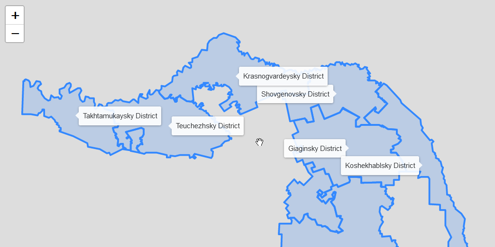

.. _data_highcharts:

Как подключить данные в Highcharts Maps (highcharts.js)
===========================

* `Order data <https://data.nextgis.com/en/>`_ for your area of interest in GeoJSON format.
* Wait for email with download link, download and unpack archive with data.
* Select target layer, for example municipal boundaries (boundary-polygon-lvl6.geojson)
* To use layer in Leaflet first you need to host it (store in a place, accessible via hyperlink).

Simple Leaflet map showing a municipal boundaries layer and lables:

.. code-block:: javascript

    <!DOCTYPE html>
<html>

  <head>
    <meta charset="utf-8" />
    <meta http-equiv="X-UA-Compatible" content="IE=edge" />
    <meta name="viewport" content="width=device-width, initial-scale=1" />
    <title>Show Data layer on the Leaflet</title>

    <link rel="stylesheet" href="https://unpkg.com/leaflet@1.7.1/dist/leaflet.css" />
    
    
  </head>

  <body>
    

    
  </body>

</html>

The result:

