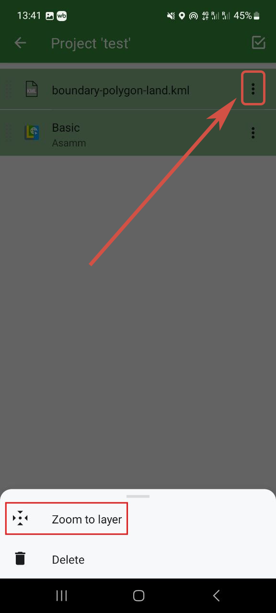

How to upload data to Locus GIS mobile app
==================================================

`Order data <https://data.nextgis.com/en/>`_ for your area of interest in KML (Google Earth) format. 

Wait for an email with the download link. Download and **unpack** the data.

Download and install Locus GIS  [#]_ app to your mobile device. 

Open the app and create a new project. To do so open the menu (three stripes in the top left corner) and go to the Projects tab.

.. figure:: _static/locus_menu_en.png
   :name: 
   :align: center
   :width: 8cm

   Opening menu

.. figure:: _static/locus_menu_proj_en.png
   :name: 
   :align: center
   :width: 8cm

   Opening Projects tab

Press "+" in the bottom right corner and select **New empty project**.

.. figure:: _static/locus_new_proj_en.png
   :name: 
   :align: center
   :width: 8cm

   Creating new project

.. figure:: _static/locus_new_proj_empty_en.png
   :name: 
   :align: center
   :width: 8cm

   Selecting empty project

Enter a name for the project, select a Coordinate Reference System and coordinate type. Add description if you need. Then press **Ok**.

.. figure:: _static/locus_new_proj_set_en.png
   :name: 
   :align: center
   :width: 8cm

   New project settings

To add a new layer press the "+" in the bottom right corner and in the menu select **Display file**.

.. figure:: _static/locus_layer_create_en.png
   :name: 
   :align: center
   :width: 8cm

   Creating new layer

.. figure:: _static/locus_display_file_en.png
   :name: 
   :align: center
   :width: 8cm

   Selecting to create a layer from file

For the source select **Main directory**, then open the folder in your device and select the KML file. 

.. figure:: _static/locus_source_folder_en.png
   :name: 
   :align: center
   :width: 8cm

   Selecting Main directory as data source

.. figure:: _static/locus_source_file_en.png
   :name: 
   :align: center
   :width: 8cm

   Selecting data file

A layer created from this file will appear in the project.

.. figure:: _static/locus_file_added_en.png
   :name: 
   :align: center
   :width: 8cm

   Newly added layer in the project

After the layer is added open its context menu (three dots on the right) and press **Zoom to layer**. 

   Selecting Zoom to layer
	
The data you added will be displayed on the project map.

.. figure:: _static/locus_result_en.png
   :name: 
   :align: center
   :width: 8cm

   Data on the map

.. [#] Locus GIS application can be considered a free alternative for Locus MAP 4. The functionality of the apps is very similar.
