Как загрузить данные в приложение Locus GIS
==================================================

`Закажите данные <https://data.nextgis.com/ru/>`_ на интересующую Вас территорию в формате KML (Google Earth). 

Дождитесь получения результата, `скачайте <https://data.nextgis.com/ru/orders/actual/>`_ и **распакуйте** архив с данными.

Скачайте и установите приложение Loсus GIS [#]_ на мобильное устройство. 

Откройте его и создайте новый проект. Для этого вызовите меню (три полоски в левой верхней части экрана) и перейдите во вкладку «Проекты».

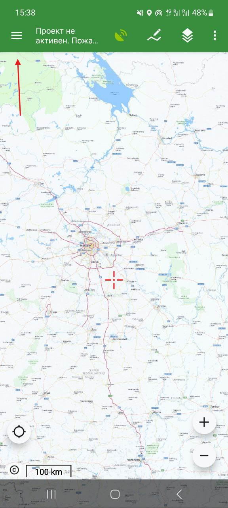

   Вызов меню

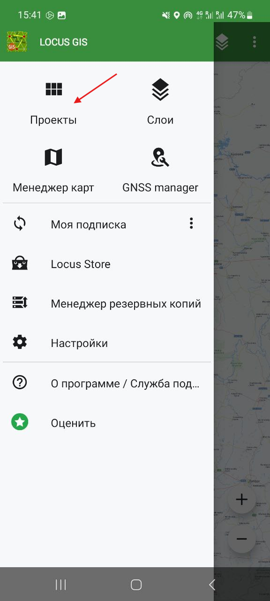

   Переход в раздел "Проекты"

Нажмите на плюс в нижней правой части экрана и выберите из предложенного списка **Новый пустой проект**.

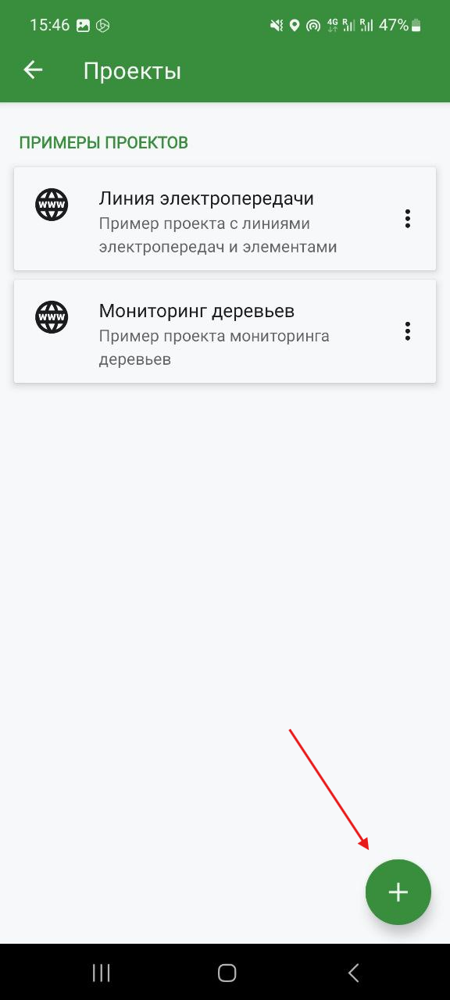

   Создание нового проекта

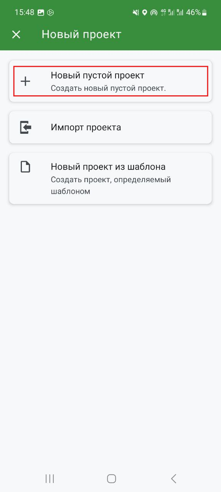

   Выбор создания пустого проекта

Дайте проекту имя, выберете исходную систему координат, а также тип координат. При необходимости, добавьте описание проекта и нажмите **Ок**.

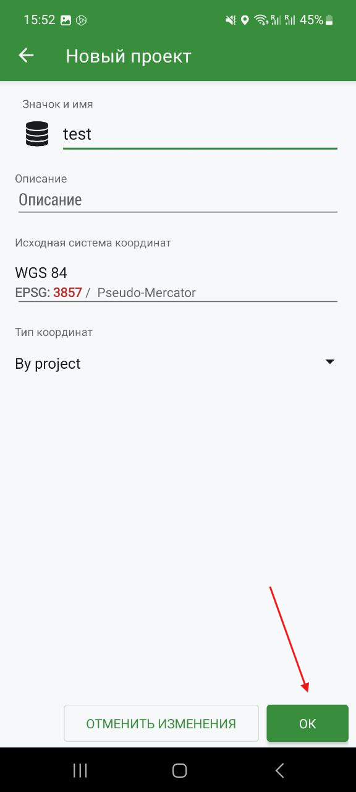

   Параметры нового проекта

Далее нажмите на плюс в нижней правой части экрана и перейдя в меню создания слоев, выберите **Отображение файлов**.

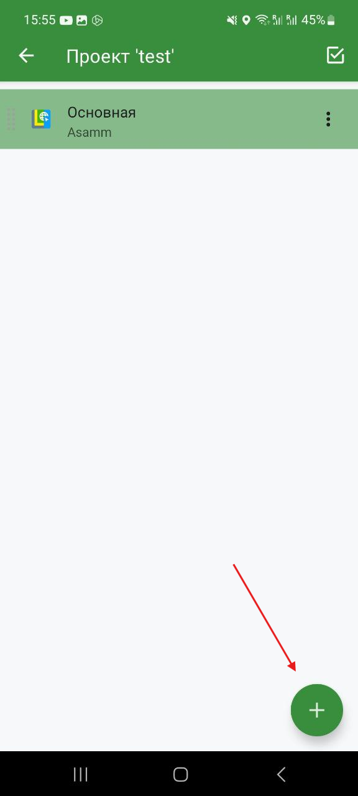

   Создание нового слоя

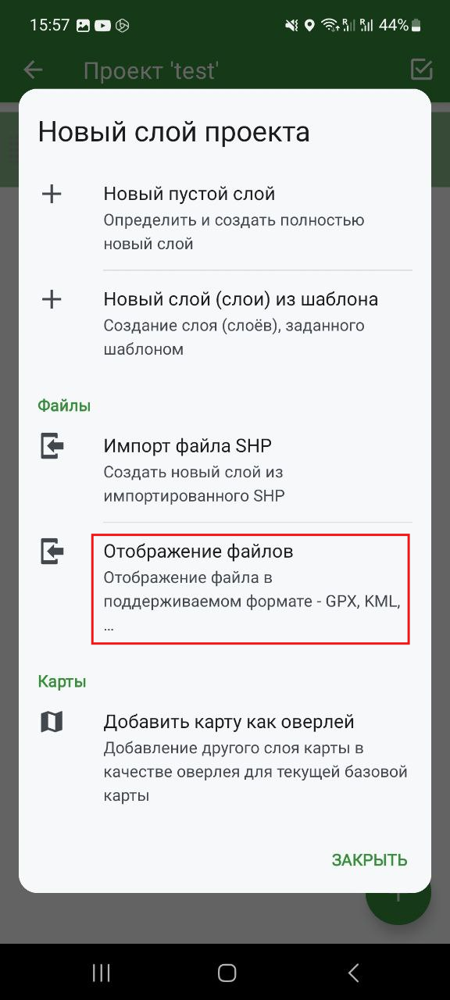

   Выбор создания слоя для отображения данных из файла

В качестве источника данных выберите «Основная папка», а затем, перейдя в необходимую директорию на мобильном устройстве, выберите файл в формате KML. 

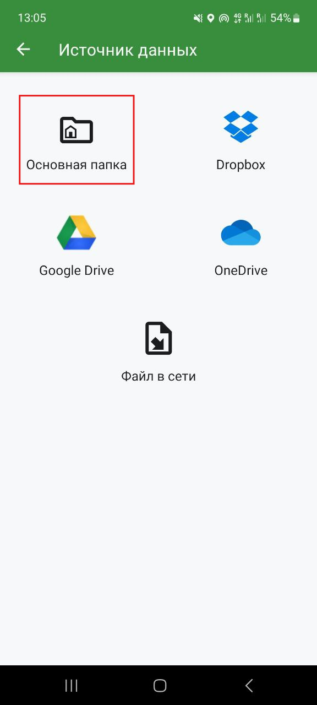

   Выбор Основной папки в качестве источника данных

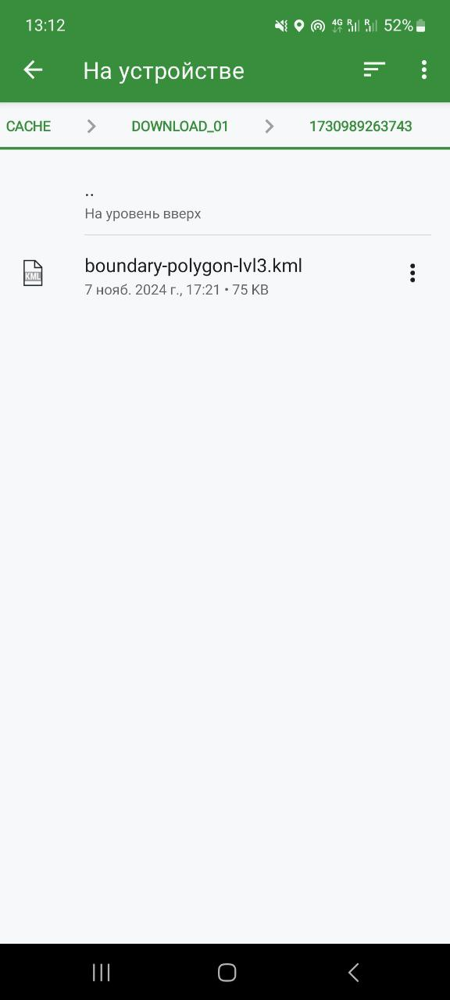

   Выбор файла с данными

Созданный из файла слой появится в слоевой структуре проекта.

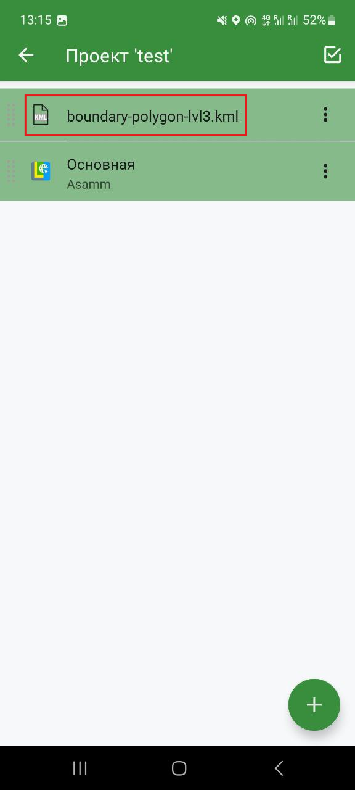

   Добавленный слой в структуре проекта

После успешной загрузки вызовите контекстное меню (три точки в правой части загруженного слоя) и нажмите на **Масштаб по слою**. 

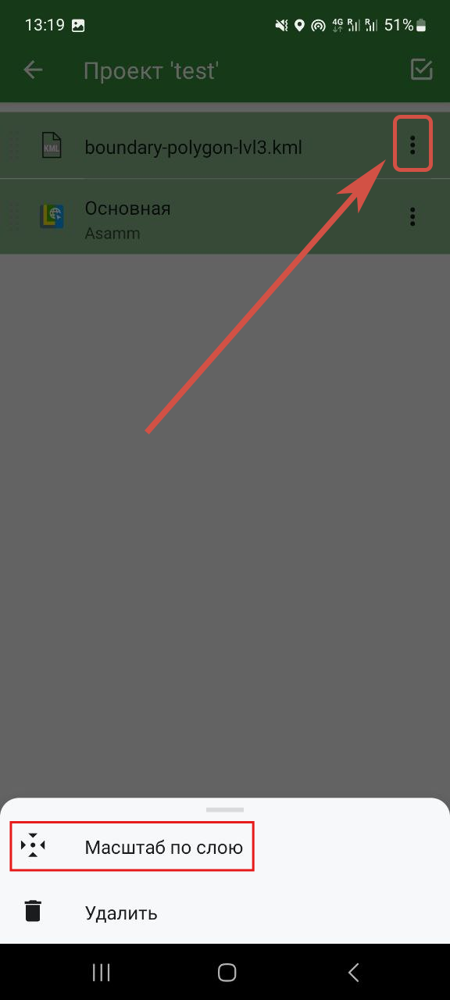

   Установление масштаба по слою
	
После этого на главном экране проекта появятся Ваши данные.

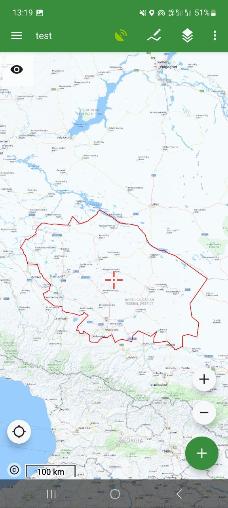

   Данные на карте

.. [#] Приложение Locus GIS может рассматриваться как аналог программы Locus MAP 4, которая, к сожалению, недоступна для пользователей на территории Российской Федерации и является платной. Однако стоит отметить, что функционал обоих приложений практически идентичен.
